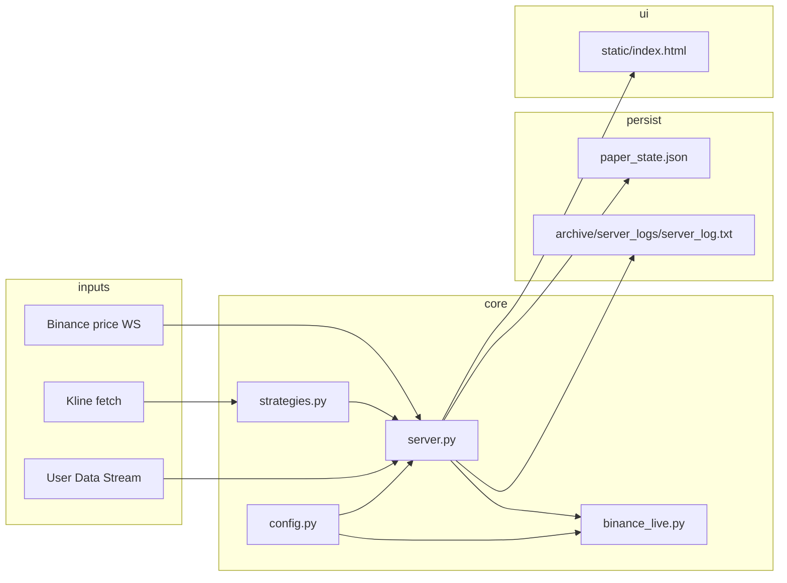

# Antigravity — Agent Handoff

เอกสารนี้ใช้ให้ AI agent รับงานต่อได้เร็วและไม่พัง behavior สำคัญของบอทเทรด Binance USDT-M Futures

---

## Agent Operating Rules

ทุกครั้งที่แก้ **โค้ด, config, dashboard, recovery, trading behavior, risk control, หรือ runtime workflow**:

1. อัปเดตไฟล์นี้ในชุดงานเดียวกัน
2. เพิ่ม entry ท้ายส่วน **Change Log** ในรูปแบบ `### YYYY-MM-DD: หัวข้อสั้นๆ`
3. ระบุไฟล์ที่แก้, ปัญหา/เป้าหมาย, วิธีแก้, ผลกระทบ, วิธี verify
4. ถ้ามี commit ให้รวม `.agents/AGENTS.md` ใน commit เดียวกับ code change
5. ถ้างานกระทบ **ภาพรวมโปรเจกต** (tab map, architecture, default config, state schema, invariants, API หลัก) → อัปเดต `context.md` ด้วย — ดูเกณฑ์ใน `context.md` section "เมื่อไหร่ควรอัปเดต context.md"

---

## Project Summary

| หัวข้อ | รายละเอียด |
|--------|------------|
| ประเภท | Multi-strategy crypto futures bot + FastAPI dashboard |
| Exchange | Binance USDT-M Futures (hedge mode) |
| Entry point | `server.py` — FastAPI app บนพอร์ต **6000** |
| State | `paper_state.json` (runtime, อย่า commit) |
| Config | `config.py` + `.env` |
| Strategies | `strategies.py` — signal evaluators ต่อ Tab |
| Live orders | `binance_live.py` — signed REST helpers |
| UI | `static/index.html` |

---

## Architecture



### Background loops (`lifespan` ใน `server.py`)

- `fetch_scan_symbols` / `refresh_scan_symbols_loop` — universe สัญลักษณ์ (`SCAN_SYMBOLS`)
- `binance_ws_loop` / `price_tick_monitor_loop` / `price_poll_loop` — ราคา real-time + paper/local exits
- `scheduler_loop` — ประเมินสัญญาณตาม timeframe (1h / 4h)
- `user_data_stream_loop` — order/position updates (เมื่อ `LIVE_MODE=true`)
- `sync_live_positions` — reconcile state กับ exchange
- `process_watchdog_loop` — alert เมื่อ loop ค้าง
- `income_sync_loop` — ดึง realized PnL / commission / funding

### Signal → entry flow

1. `evaluate_candle_signals(interval)` รันตาม scheduler
2. แต่ละ Tab เรียก `strategies.evaluate_tab*` บน OHLCV
3. ผ่าน gate: tab enabled, ไม่ซ้ำ setup, ไม่เกิน max positions
4. `execute_entry` → live: `binance_live` วาง market + algo SL/TP

---

## Tab Map (16 tabs)

| Tab | Timeframe | Strategy function | หมายเหตุ |
|-----|-----------|-------------------|----------|
| Tab1 | 4h | `evaluate_tab1_ema4h` | EMA pullback 110/190 |
| Tab2 | 4h | `evaluate_tab2_ema_1h` | EMA cross + ATR (ชื่อฟังก์ชัน legacy) |
| Tab3 | 4h | `evaluate_tab3_smc260` | SMC order block |
| Tab4 | 4h | `evaluate_tab4_ote` | Premium/discount OTE |
| Tab5 | 1h | `evaluate_tab5_rsi_divergence_1h` | RSI divergence |
| Tab6 | 4h | `evaluate_tab6_squeeze_1h` | BB/KC squeeze |
| Tab7 | 4h | `evaluate_tab7_cci_1h` | CCI |
| Tab8 | 1h | `evaluate_tab8_three_soldiers_crows` | Candle pattern |
| Tab9 | 1h | `evaluate_tab9_impulse_move_continuation` | Impulse continuation |
| Tab10 | 1h | `evaluate_tab10_vol_range_expansion_spike` | Volume range expansion |
| Tab11 | 1h | `evaluate_tab11_volume_pressure_proxy` | Volume pressure |
| Tab12 | 1h | `evaluate_tab12_volume_spike_breakout` | Volume spike breakout |
| Tab13 | 4h | `evaluate_tab13_impulse_move_continuation_4h` | retag จาก Tab9 |
| Tab14 | 4h | `evaluate_tab14_vol_range_expansion_spike_4h` | retag จาก Tab10 |
| Tab15 | 4h | `evaluate_tab15_volume_pressure_proxy_4h` | retag จาก Tab11 |
| Tab16 | 4h | `evaluate_tab16_volume_spike_breakout_4h` | retag จาก Tab12 |
| Tab17 | 1h | `evaluate_tab17_momentum_vol_pressure_1h` | Tab11 signal + momentum universe top 50 |
| Tab18 | 1h | `evaluate_tab18_volume_pressure_breakout_1h` | Vol ultimate (0.585 long, 0.428 short, EMA40, RR 0.85) |

รายละเอียดพารามิเตอร์แต่ละ Tab: `config.py` และ `docs/strategies_spec.md`

**Startup default:** `Tab3`, `Tab11` เปิด (`STARTUP_ENABLED_TABS` ใน `config.py`) — tab อื่นปิดจนกว่า user เปิดจาก dashboard

---

## Critical Invariants (ห้ามพัง)

### Hedge mode + `position_side`

- ทุก live order/close/cancel ต้องส่ง `positionSide` (`LONG` / `SHORT`) ให้ตรงกับ hedge leg
- Reconcile ระดับ `(symbol, position_side)` ไม่ใช่แค่ symbol
- Broad cancel บน symbol ที่มีทั้ง LONG และ SHORT ต้อง refuse หรือ scope ตาม side
- `handle_order_update()` match fill ด้วย `positionSide` + `sl_order_id` / `tp_order_id`
- หลาย Tab อาจ share hedge key เดียวกัน — แต่ละ state position เป็น `sym_TabN`

### State file safety

- `save_state()` เขียนผ่าน atomic temp file + `os.replace`
- `_state_write_guard_allows_save()` บล็อก save ที่ history/open/used_setups หดผิดปกติ → dump เป็น `archive/paper_state/rejected_shrink_*.json`
- **อย่า** ย้าย `paper_state.json` ออกจาก root โดยไม่แก้ path ทุกจุด

### Single instance

- `server.lock` + Windows mutex `Local\AntigravityMultiStrategyServer`
- ก่อน debug ให้เช็กว่า process ไหนถือพอร์ต 6000 จริง

### ORDER_ENV vs PRICE_FEED_ENV

- `ORDER_ENV` — ส่งคำสั่ง (testnet/mainnet)
- `PRICE_FEED_ENV` — ดึงราคา/kline (แยกได้)
- ถ้า dashboard ไม่ตรง Binance UI ให้เช็กว่าเปิดหน้า testnet ตรงกับ config หรือไม่

### Algo order limit

- Binance จำกัด open algo orders (~100) — recovery/repair loop ต้องไม่ spam วาง SL/TP ซ้ำเมื่อเต็ม limit (`-4045`)

---

## File Map

| Path | บทบาท |
|------|--------|
| `server.py` | Entry point (~25 lines); `import server` → `bot.core` namespace |
| `bot/core.py` | Trading engine, state, sync, FastAPI app (~11k lines; hub until domain split) |
| `bot/logging_setup.py` | Terminal/file log capture |
| `bot/state/accessors.py` | Effective/normalize helpers, tab/symbol stats, SLTP mode |
| `bot/state/position_identity.py` | Hedge keys, client IDs, position registry, algo helpers |
| `bot/state/persistence.py` | `load_state`, `save_state`, atomic write + shrink guard |
| `bot/state/schema.py` | Default `paper_state.json` schema |
| `bot/engine/protection.py` | SL/TP local vs exchange policy |
| `bot/engine/ops.py` | Telegram, error events, health snapshot |
| `bot/engine/signals_registry.py` | Tab→evaluator registry for scan |
| `binance_live.py` | Signed REST: orders, algo SL/TP, positions, income |
| `strategies.py` | Pure signal logic (pandas/numpy) |
| `config.py` | Constants, env vars, tab params |
| `static/index.html` | Dashboard (Live Positions merge กับ bot state) |
| `paper_state.json` | Runtime state (balances, positions, history, tab flags) |
| `.env` | Secrets & runtime flags (อย่า commit) |
| `tests/` | Unit tests (`test_server_hedge.py`, `test_volume_strategies.py`, …) |
| `scripts/` | Utilities: reset state/tabs, recovery, fetch data/logs |
| `docs/strategies_spec.md` | Strategy parameter spec |
| `archive/` | Backups เก่า: `paper_state/`, `server_logs/` (gitignored) |
| `cache/` | OHLCV parquet จาก `scripts/fetch_data.py` (gitignored) |

---

## Environment & Run

### Python

```powershell
cd E:\antigravity
.\.venv\Scripts\python.exe server.py
```

- ใช้ **`.venv`** เท่านั้น (ไม่ใช้ `venv/`)
- Dependencies: `requirements.txt`

### ตัวแปรสำคัญใน `.env`

| Variable | ความหมาย |
|----------|----------|
| `LIVE_MODE` | `true` = ส่ง order จริง |
| `ORDER_ENV` | `testnet` \| `mainnet` |
| `PRICE_FEED_ENV` | `testnet` \| `mainnet` |
| `BINANCE_API_KEY` / `SECRET` | API credentials |
| `BINANCE_API_ACCOUNT_TYPE` | `futures_regular` \| `leader_trade` |
| `LEVERAGE` | default 5 |
| `DASHBOARD_PASSCODE` | ถ้าเปิด auth |
| `CIRCUIT_BREAKER_DAILY_LOSS` | daily loss limit (USD) |
| `TELEGRAM_*` | TP/SL exit + errors only (no entry/sync Telegram) |

### Verify หลังแก้โค้ด

```powershell
.\.venv\Scripts\python.exe -m py_compile server.py binance_live.py strategies.py
.\.venv\Scripts\python.exe -m unittest discover -s tests -t . -p "test_*.py"
```

Dashboard: `http://localhost:6000`

### API endpoints (หลัก)

| Method | Path | 用途 |
|--------|------|------|
| GET | `/` | Dashboard HTML |
| WS | `/ws` | Real-time updates |
| GET | `/api/trades` | Trade history |
| GET | `/api/health` | Health snapshot |
| GET | `/api/logs` | Log buffer |
| POST | `/api/tab-enabled` | เปิด/ปิด tab |
| POST | `/api/close-all` | ปิดทุก position |
| POST | `/api/close-all-long` | ปิดเฉพาะ LONG hedge legs |
| POST | `/api/close-all-short` | ปิดเฉพาะ SHORT hedge legs |
| POST | `/api/test-hedge*` | Test endpoints (testnet only) |

---

## `paper_state.json` Schema (ย่อ)

```json
{
  "balances": { "Tab1": 2000.0, ... },
  "unrealized_pnls": { "Tab1": 0.0, ... },
  "open_positions": {
    "BTCUSDT_Tab11": {
      "symbol": "BTCUSDT",
      "tab": "Tab11",
      "side": "long",
      "position_side": "LONG",
      "entry": 95000.0,
      "sl": 94000.0,
      "tp": 97000.0,
      "sl_order_id": 123,
      "tp_order_id": 456
    }
  },
  "position_registry": {},
  "history": [],
  "used_setups": [],
  "tab_enabled": { "Tab1": false, "Tab11": true, ... },
  "circuit_breaker": false,
  "binance_income": { "realized_pnl": 0, "commission": 0, "funding": 0, "last_ts": 0 },
  "sync_issues": [],
  "error_events": []
}
```

Position key = `{symbol}_{tab}`

---

## Common Tasks

### เพิ่ม/แก้ strategy

1. พารามิเตอร์ใน `config.py`
2. `evaluate_tabN_*` ใน `strategies.py`
3. ผูกใน `evaluate_candle_signals()` ตาม timeframe
4. อัปเดต `docs/strategies_spec.md` และ entry ใน Change Log ด้านล่าง
5. เพิ่ม unit test ถ้า logic ซับซ้อน

### แก้ live order / SL-TP / sync

- อ่าน `binance_live.py` + `sync_live_positions()` + `_close_position_unsafe()`
- รัน `tests/test_server_hedge.py` ทุกครั้ง
- ทดสอบบน testnet ก่อน mainnet

### แก้ dashboard

- `static/index.html` — ตาราง Live Positions merge exchange + bot metadata

---

## Ignored Paths (`.cursorignore`)

อย่าพึ่งพา AI อ่านจาก index: `.env`, `.venv/`, `paper_state.json`, `server_log.txt*`, `archive/`, backups

---

## Change Log

บันทึกการเปลี่ยนแปลงสำคัญต่อจากนี้ (ใหม่สุดอยู่บน)

### 2026-06-22: Dashboard — paper curve Tab18 + All both start from $0

- **ไฟล์:** `static/index.html`, `.agents/AGENTS.md`
- **เป้าหมาย:** Tab18 กราฟเริ่มจาก **$0** (cumulative PnL) ให้สอดคล้องกับ Tab All — สลับ filter ไม่กระโดดแกน Y
- **วิธีแก้:** ปิด paper equity baseline (`paperEquityCurve = false`) ทั้ง All และ per-tab; caption บอก scale เดียวกัน
- **Verify:** hard refresh PAPER → All กับ Tab18 กราฟรูปเดียวกันเมื่อเปิดแค่ Tab18; แกนเริ่ม $0

### 2026-06-22: Dashboard — paper equity curve All + Tab18 same baseline

- **ไฟล์:** `static/index.html`, `.agents/AGENTS.md`
- **ปัญหา:** Paper mode — filter **All** แสดง cumulative PnL จาก $0 แต่ **Tab18** แสดง equity จาก `initial_balance` ($7k) → สลับ tab กราฟกระโดด ไม่ต่อเนื่อง
- **วิธีแก้:** `usePaperEquityCurve()` ใช้ deposit baseline ทั้ง All และ per-tab; caption บอก scale เดียวกัน
- **Verify:** hard refresh PAPER → All กับ Tab18 (เมื่อเปิดแค่ Tab18) กราฟรูปเดียวกัน เริ่มที่ $7,000

### 2026-06-22: Fix paper mode SL/TP — price monitor skipped all positions

- **ไฟล์:** `bot/core.py`, `tests/test_server_hedge.py`, `.agents/AGENTS.md`
- **ปัญหา:** `_check_local_position_exits_unsafe` มี guard `if not _position_needs_local_exit_monitor(pos) and not LIVE_MODE: continue` ทำให้ **paper mode ข้ามทุก position** — SL/TP ไม่ปิดอัตโนมัติ (มี 20 ไม้เปิดค้าง บางตัว mark แตะ SL/TP แล้ว)
- **วิธีแก้:** ลบ guard ผิด — paper ใช้ branch `not LIVE_MODE and price … sl/tp` ตามเดิม; live ยังเช็ค local + missing-exchange
- **Verify:** `python -m unittest tests.test_server_hedge.HedgeOwnershipTests.test_paper_price_monitor_closes_on_sl_tp -v`; restart server → ไม้ที่ mark แตะ SL/TP ควรปิดภายใน ~1s

### 2026-06-22: Dashboard — curve/history range 1 day option

- **ไฟล์:** `static/index.html`, `.agents/AGENTS.md`
- **เป้าหมาย:** เลือกช่วงย้อนหลัง 1 วันได้ทั้ง equity curve และ Recent Trades
- **วิธีแก้:** เพิ่ม `1` วันใน `equityCurveDaysSel` และ `historyDaysSel`; `formatDashboardRangeLabel(1)` → `1 day` (backend `days=` รองรับอยู่แล้ว)
- **Verify:** hard refresh → Curve range / Range มี 1 day → meta แสดง `1 day`; stats + curve sync ตาม `dashboardRangeDays`

### 2026-06-22: Script — import paper_state JSON snapshot (Tab18 mar2025)

- **ไฟล์:** `scripts/import_paper_state_snapshot.py`, `.agents/AGENTS.md`
- **เป้าหมาย:** นำ `tab18_paper_state_mar2025_full.json` (หรือ export อื่น) เข้า `paper_state.json`
- **วิธีใช้:** วางไฟล์ที่ repo root → `python scripts/import_paper_state_snapshot.py --apply` (หรือ `--full-replace` ถ้าเป็น full state); backup ไป `archive/paper_state/`
- **Verify:** dry-run แสดง row count + exit range; หลัง apply restart server → dashboard All time ตรงจำนวน closes
- **2026-06-22:** Imported `Downloads/tab18_paper_state_mar2025_full.json` → 35,176 Tab18 closes (2025-03-01 → 2026-06-21), balance $25,886.17

### 2026-06-22: HISTORY_CAP default 50,000

- **ไฟล์:** `config.py`, `.env.example`, `.agents/AGENTS.md`
- **เป้าหมาย:** เก็บประวัติปิดไม้ใน `paper_state.json` ได้สูงสุด 50k (เดิม 10k)
- **วิธีแก้:** `HISTORY_CAP` env (default `50000`); trim ใน `exit.py` / `sync_helpers.py` ใช้ค่านี้
- **Verify:** `python -c "import config; print(config.HISTORY_CAP)"` → 50000; re-import backtest ถ้า state ยังมีแค่ 10k

### 2026-06-22: Dashboard — Avg Profit/Day and Max DD aligned with history range

- **ไฟล์:** `static/index.html`, `.agents/AGENTS.md`
- **ปัญหา:** Avg Profit/Day ใช้ WS cap + หารด้วยวันถึงวันนี้; Max DD ล็อก 30D จาก WS ไม่ตรง curve/history range
- **วิธีแก้:** คำนวณจาก `equityCurvePayload` + `strategyStatsPayload` ตาม `dashboardRangeDays` — realized net / วันในช่วง; MDD จาก equity curve ในช่วงที่เลือก
- **Verify:** เลือก 30 days vs All time → Avg/MDD เปลี่ยนตาม; subtitle แสดง range label

### 2026-06-22: Quick Tunnel script — DASHBOARD_PORT + URL log

- **ไฟล์:** `tools/start-quick-tunnel.ps1`, `.agents/AGENTS.md`
- **ปัญหา:** tunnel ชี้ port 8000 แต่ dashboard ใช้ `DASHBOARD_PORT` (8765)
- **วิธีแก้:** อ่าน port จาก `.env`; log ทั้งหมด → `tools/quick-tunnel.log`; URL ล่าสุด → `tools/quick-tunnel-url.txt` + banner สีเขียวใน terminal
- **Verify:** รัน `server.py` แล้ว `.\tools\start-quick-tunnel.ps1` → เห็น `https://….trycloudflare.com`

### 2026-06-22: Dashboard — paper mode badge → Walkforward Live

- **ไฟล์:** `static/index.html`, `.agents/AGENTS.md`
- **วิธีแก้:** Header badge + tab title + health card ใช้ `WALKFORWARD LIVE` แทน `PAPER` เมื่อ `live_mode` ปิด
- **Verify:** paper server → header badge แสดง WALKFORWARD LIVE

### 2026-06-22: Dashboard — remove Long PnL / Short PnL stat cards

- **ไฟล์:** `static/index.html`, `.agents/AGENTS.md`
- **วิธีแก้:** ลบ stat cards 🟢 Long PnL / 🔴 Short PnL และ `updateSidePnlCards`
- **Verify:** hard refresh → metrics row ไม่มี Long/Short PnL cards

### 2026-06-22: Dashboard — hide Strategy Performance for screenshots

- **ไฟล์:** `static/index.html`, `.agents/AGENTS.md`
- **เป้าหมาย:** ปุ่มซ่อนตาราง Strategy Performance ตอน screenshot
- **วิธีแก้:** ปุ่ม `📷 Hide` ใน header ของ panel; ซ่อนทั้ง panel + แสดงลิงก์ `Show Strategy Performance` ใต้ equity curve; จำ state ใน `localStorage` (`hideStrategyPerformancePanel`)
- **Verify:** กด Hide → ตารางหาย; hard refresh ยังซ่อน; กด Show (sidebar ซ้าย) → กลับมา

### 2026-06-22: Max DD — compute from full history, not downsampled chart

- **ไฟล์:** `bot/engine/history.py`, `static/index.html`, `tests/test_server_hedge.py`, `.agents/AGENTS.md`
- **ปัญหา:** Max DD card คำนวณจาก equity curve ที่ downsample (~2000 pts จาก 35k closes) → Tab18 all-time แสดง ~5.6% แทน true ~2.7% (peak-to-trough $645 จาก $23,988 → $23,275, May–Jun 2026)
- **วิธีแก้:** `GET /api/equity-curve` คืน `max_drawdown` จาก full series ก่อน downsample; dashboard ใช้ค่านี้แทน client-side บน chart points; All-tab curve filter enabled tabs เหมือน UI
- **Verify:** `python -c "from bot.state.persistence import load_state; from bot.engine.history import _dashboard_equity_curve_api; load_state(); print(_dashboard_equity_curve_api(tab='Tab18')['max_drawdown'])"` → pct ~2.6966; `unittest tests.test_server_hedge.HistoryPaginationTests.test_equity_curve_max_drawdown_from_full_series_not_downsample`

### 2026-06-22: Dashboard — range options 7d and 30d

- **ไฟล์:** `static/index.html`, `.agents/AGENTS.md`
- **วิธีแก้:** เพิ่ม `7` / `30` วันใน Curve range + Recent Trades Range (sync กับ stats/curve อยู่แล้ว)
- **Verify:** hard refresh → เลือก 7 days / 30 days → meta แสดง `7 days` / `30 days`

### 2026-06-22: Dashboard — Strategy Performance aligned with full trade history

- **ไฟล์:** `bot/engine/history.py`, `bot/api/web.py`, `bot/core.py`, `static/index.html`, `tests/test_server_hedge.py`, `.agents/AGENTS.md`
- **ปัญหา:** Strategy Performance ใช้ WS `stats_trade_history` (cap 800 / ~90d) ไม่ตรงกับ Recent Trades / equity curve ที่ดึงจาก REST
- **วิธีแก้:** `GET /api/strategy-stats?days=` คำนวณ trades/wins/Profit/Loss จาก history ทั้งก้อน; Range selector เดียวกัน (`dashboardRangeDays`) sync ทั้ง Recent Trades, curve, stats
- **Verify:** Tab18 + All time → Wins/Win%/Profit ตรงจำนวน closes ใน pager meta (เช่น 10000)

### 2026-06-22: Dashboard — curve/history range 2y and 3y options

- **ไฟล์:** `static/index.html`, `.agents/AGENTS.md`
- **เป้าหมาย:** เลือกช่วงย้อนหลัง 2 ปี / 3 ปี ได้ทั้ง equity curve และ Recent Trades
- **วิธีแก้:** เพิ่ม `730` / `1095` วันใน `equityCurveDaysSel` และ `historyDaysSel` (backend รองรับ `days=` อยู่แล้ว)
- **Verify:** hard refresh → Curve range / Range มี 2 years, 3 years → meta แสดง `last 730d` / `last 1095d`

### 2026-06-22: Dashboard — full equity curve via GET /api/equity-curve

- **ไฟล์:** `bot/engine/history.py`, `bot/api/web.py`, `config.py`, `bot/core.py`, `static/index.html`, `.env.example`, `tests/test_server_hedge.py`, `.agents/AGENTS.md`
- **เป้าหมาย:** ดู equity curve ย้อนหลังได้ไกลสุด (ทั้ง backtest 10k ใน state) โดยไม่พึ่ง WS cap 800 จุด
- **วิธีแก้:** `GET /api/equity-curve?tab=&days=0&max_points=` สร้าง cumulative series จาก history ทั้งก้อน + downsample สูงสุด `DASHBOARD_EQUITY_CURVE_MAX_POINTS` (default 2000); UI เลือก Curve range All / 90d / 365d ใต้กราฟ
- **Verify:** Tab18 + All time → meta แสดง `10000 closes`; กราฟยาวขึ้นชัด vs WS-only

### 2026-06-22: Dashboard port 8765 — Chrome/Edge block 6000 (ERR_UNSAFE_PORT)

- **ไฟล์:** `config.py`, `.env.example`, `bot/logging_setup.py`, `context.md`, `.agents/AGENTS.md`
- **ปัญหา:** Chrome/Edge/Chromium ไม่เปิด `http://localhost:6000` (พอร์ต X11 ถูก block) → ผู้ใช้เห็นว่า dashboard "เปิดไม่ได้" แม้ server รันอยู่
- **วิธีแก้:** default `DASHBOARD_PORT=8765`; startup banner เตือนถ้ายังใช้ 6000
- **Verify:** ตั้ง `DASHBOARD_PORT=8765` ใน `.env` → restart → เปิด `http://localhost:8765` → WS Connected

### 2026-06-22: Dashboard JS — fix blank page after pagination (duplicate `let`, missing startup)

- **ไฟล์:** `static/index.html`, `.agents/AGENTS.md`
- **ปัญหา:** หลังเพิ่ม history pager — ลบ `initApp()` ตอนต้นสคริปต์แต่ไม่เรียกใหม่ท้ายไฟล์; ประกาศ `let historyPageOffset` ซ้ำใน scope เดียว → `SyntaxError` ทำให้ JS ทั้งก้อนไม่รัน, dashboard ว่าง
- **วิธีแก้:** ลบ duplicate `let`; เรียก `initHistoryPager(); initApp();` ท้ายสคริปต์ (หลังนิยามฟังก์ชันทั้งหมด); Chart.js init อยู่ใน try/catch แล้ว
- **Verify:** hard refresh `http://localhost:6000` → WS Connected, stats/positions โหลด, Recent Trades pager ทำงาน

### 2026-06-22: Dashboard equity curve — แกน X แสดงปี

- **ไฟล์:** `static/index.html`
- **เป้าหมาย:** label ด้านล่างกราฟ equity curve แสดงปีด้วย (ไม่ใช่แค่วัน/เดือน)
- **วิธีแก้:** `formatCurveExitLabel` เพิ่ม `year: 'numeric'`; margin curve ใช้ helper เดียวกัน
- **Verify:** hard refresh dashboard → แกน X กราฟ curve แสดงเช่น `22 Jun 2025 14:30`

### 2026-06-22: Dashboard — paginated Recent Trades (`GET /api/history`)

- **ไฟล์:** `bot/engine/history.py`, `bot/api/web.py`, `config.py`, `bot/core.py`, `static/index.html`, `.env.example`, `.agents/AGENTS.md`
- **เป้าหมาย:** เลื่อนดูประวัติปิดไม้ย้อนหลังทีละหน้าใน UI โดยไม่ส่ง history ทั้งก้อนผ่าน WebSocket
- **วิธีแก้:** `GET /api/history?tab=&offset=&limit=&days=` (newest first; `days=0` = all time ใน state); Recent Trades ใช้ REST + ปุ่ม Older/Newer, เลือก per page / range; WS ยัง cap ที่ `DASHBOARD_WS_HISTORY_LIMIT` สำหรับกราฟ
- **Verify:** restart → Recent Trades แสดง `1–50 of N`; กด **← Older** → offset เพิ่ม; filter Tab18 + All time → ไล่ backtest ได้

### 2026-06-22: Dashboard WS — cap history payload (fix blank page when history >1MB)

- **ไฟล์:** `bot/engine/history.py`, `config.py`, `server.py`, `bot/core.py`, `.env.example`, `.agents/AGENTS.md`
- **ปัญหา:** หลัง import backtest 10k closes → WebSocket ส่ง `recent_history`/`stats_trade_history`/`equity_close_series` รวม ~8MB → frame เกิน 1MB default → browser WS หลุด, dashboard ค้างว่าง (HTML โหลดได้ที่ `:6000`)
- **วิธีแก้:** `_dashboard_ws_history_rows()` กรองตาม `BINANCE_CLOSE_HISTORY_DAYS` แล้ว cap `DASHBOARD_WS_HISTORY_LIMIT` (default 800); `uvicorn.run(..., ws_max_size=16MB)` เป็น safety net
- **Verify:** restart server → เปิด `http://localhost:6000` → WS Connected + ตารางโหลด; `python -c` วัด payload < 1MB

### 2026-06-22: Publish links — borbaibank GitHub + Gumroad

- **ไฟล์:** `docs/PUBLISH_LINKS.md`, `docs/README_COMMUNITY_PUBLIC.md`, `docs/GUMROAD_PRO.md`, `antigravity_pro/README.md`
- **เป้าหมาย:** แทน placeholder ด้วย `borbaibank` จาก `git remote`
- **Verify:** rebuild zip; สร้าง Gumroad product URL `antigravity-pro` + repo `antigravity-community` บน GitHub

### 2026-06-22: Public README + Gumroad copy + package_pro script

- **ไฟล์:** `docs/README_COMMUNITY_PUBLIC.md`, `docs/GUMROAD_PRO.md`, `scripts/package_pro.ps1`, `scripts/build_community.py`, `.agents/AGENTS.md`
- **เป้าหมาย:** พร้อม publish — README สำหรับ GitHub public + ข้อความหน้า Gumroad Pro + zip ส่งมอบลูกค้า
- **วิธีแก้:** build community คัดลอก README จาก docs; `package_pro.ps1` → `dist/antigravity-pro-*.zip`
- **Verify:** แก้ `YOUR-SELLER` / `YOUR-ORG` ใน README + GUMROAD_PRO แล้วรัน `publish_community.ps1` + `package_pro.ps1`

### 2026-06-22: Phase 3 — Pro LICENSE, publish scripts, edition WS flag

- **ไฟล์:** `antigravity_pro/LICENSE`, `antigravity_pro/INSTALL.md`, `docs/EDITIONS.md`, `scripts/publish_community.ps1`, `.github/workflows/community-release.yml`, `bot/api/web.py`, `static/index.html`, `antigravity_pro/__init__.py`, `.gitignore`, `.agents/AGENTS.md`
- **เป้าหมาย:** พร้อมขาย — commercial license Pro, zip community, GitHub release workflow, dashboard รู้ว่า Pro ติดตั้งแล้ว
- **วิธีแก้:** WS ส่ง `premium_loaded` / `edition`; แบนเนอร์ community ซ่อนเมื่อ Pro active; `publish_community.ps1` + tag `community-v*` CI
- **Verify:** `pip install -e ./antigravity_pro` → log `[Pro] ... registered`; WS `premium_loaded: true`; `.\scripts\publish_community.ps1` สร้าง zip

### 2026-06-22: Community build — dist/community Tab1–10, optional TAB17 config

- **ไฟล์:** `scripts/build_community.py`, `bot/engine/premium_config.py`, `bot/state/schema.py`, `bot/state/accessors.py`, `bot/state/persistence.py`, `bot/api/web.py`, `bot/core.py`, `dist/community/` (generated), `.agents/AGENTS.md`
- **เป้าหมาย:** Phase 2 — สร้าง community release ไม่มี Pro; config/UI ไม่พึ่ง Tab11–18
- **วิธีแก้:** `build_community.py` strip config/dashboard/tests; `premium_config.py` อ่าน TAB17 แบบ optional; verify `py_compile` + `test_volume_strategies` ใน dist
- **Verify:** `python scripts/build_community.py` → exit 0; `dist/community` ไม่มี `antigravity_pro`, ไม่มี Tab11 ใน index.html/config

### 2026-06-22: Pro add-on package — antigravity_pro (Tab11–Tab18)

- **ไฟล์:** `antigravity_pro/` (`__init__.py`, `config.py`, `strategies.py`, `registry.py`, `entry_hooks.py`, `pyproject.toml`, `README.md`), `bot/engine/premium_hooks.py`, `bot/engine/signals_registry.py`, `bot/engine/entry.py`, `bot/core.py`, `strategies.py`, `scripts/build_community.py`, `tests/test_volume_strategies.py`, `context.md`, `.agents/AGENTS.md`
- **เป้าหมาย:** แยก Tab11–Tab18 เป็น Pro add-on สำหรับขาย source รันเอง; Community ใช้ Tab1–Tab10
- **วิธีแก้:** `antigravity_pro.register()` ตอน `bot.core` load — merge config, evaluators, Tab17 momentum hooks; community `signals_registry` มีแค่ Tab1–10; `scripts/build_community.py` สร้าง dist ไม่มี Pro
- **Verify:** `python -m unittest tests.test_volume_strategies -q`; restart server → Tab11–18 ทำงานเมื่อมี `antigravity_pro/`; ลบโฟลเดอร์ Pro → scan ไม่มี Tab11–18

### 2026-06-22: Runtime defaults — port 6000, paper mode, $100 notional, $7000 equity start

- **ไฟล์:** `config.py`, `server.py`, `bot/logging_setup.py`, `bot/core.py`, `bot/api/web.py`, `static/index.html`, `.env`, `.env.example`, `context.md`, `.agents/AGENTS.md`
- **เป้าหมาย:** Dashboard พอร์ต 6000; โหมด Paper; notional $100/trade; equity curve / tab ledger เริ่ม $7,000
- **วิธีแก้:** `DASHBOARD_PORT` (env, default 6000); `LIVE_MODE=false` ใน `.env`; `NOTIONAL_SIZE=100`, `INITIAL_BALANCE=7000`, `EQUITY_CURVE_MARGIN_BASELINE=7000`; dashboard ส่ง `initial_balance` แทน hardcode $2,000 ใน ROI basis
- **Verify:** restart `python server.py` → banner แสดง PAPER + `http://localhost:6000`; dashboard แสดง notional $100

### 2026-06-20: Kline prescreen — ticker watchlist ที่ :58, scan kline ต้นชั่วโมง

- **ไฟล์:** `bot/engine/prescreen.py`, `bot/state/accessors.py`, `bot/engine/entry.py`, `bot/scheduler/loops.py`, `config.py`, `.env.example`, `tests/test_server_hedge.py`, `.agents/AGENTS.md`
- **เป้าหมาย:** กรองชั้นแรกจาก 24h ticker ก่อนปิดแท่ง → เก็บ list → ต้นชั่วโมง fetch kline/eval เฉพาะเหรียญใน list
- **วิธีแก้:** `maybe_run_kline_prescreen` ที่ `KLINE_PRESCREEN_MINUTE` (default 58); state `prescreen_watchlists`; `_symbols_for_interval_scan` ใช้ watchlist เมื่อ slot ตรง; catch-up ถ้าพลาด prescreen; Short Only กรองราคาใกล้ 24h low; universe default 500
- **Config:** `KLINE_PRESCREEN_ENABLED`, `TOP_N=500`, `MIN_CHG_PCT=1.5`, `RANGE_EDGE=0.40`
- **Verify:** `unittest -k prescreen`; log `[Prescreen] 1h → N symbols` ที่ :58 แล้ว `[Scan] prescreen watchlist` ที่ :00:10; พลาด prescreen → `[Prescreen] Catch-up`

### 2026-06-20: Short Only — skip Long ตั้งแต่ scan (เร็วกว่า entry filter)

- **ไฟล์:** `bot/engine/signals_registry.py`, `bot/engine/entry.py`, `strategies.py`, `tests/test_volume_strategies.py`, `.agents/AGENTS.md`
- **ปัญหา:** `trade_side_mode=short_only` กรอง Long ที่ `execute_entry` — scan ยังคำนวณ/queue Long candidates อยู่
- **วิธีแก้:** `collect_candidate` กรอง side ก่อน queue; `evaluate_tab_signal` ส่ง `allowed_side` ให้ evaluator ที่รองรับ; Tab11/Tab15/Tab17/Tab18 ข้าม long branch เมื่อ short_only
- **Verify:** dashboard ตั้ง Short Only → scan ไม่ queue Long; `python -m unittest tests.test_volume_strategies -q`

### 2026-06-19: SL/TP trigger — last price (CONTRACT_PRICE) แทน mark

- **ไฟล์:** `config.py`, `binance_live.py`, `bot/feeds/market.py`, `bot/engine/pnl.py`, `bot/core.py`, `bot/engine/entry.py`, `bot/engine/sync.py`
- **เปลี่ยน:** ค่าเริ่มต้น `SLTP_TRIGGER_PRICE=last` — local monitor, exchange algo `workingType`, pre/post-fill protection nudge ใช้ last trade price; unrealized PnL / dashboard ยังใช้ mark
- **Env:** `SLTP_TRIGGER_PRICE=mark` ถ้าต้องการพฤติกรรมเดิม (MARK_PRICE)
- **Verify:** restart server; เปิดไม้ใหม่ → algo order ใช้ CONTRACT_PRICE; log `[Local SL/TP]` แสดง `price=` จาก last

### 2026-06-19: ExchangeSync close — split PnL by tab qty on shared hedge leg

- **ไฟล์:** `bot/engine/sync_helpers.py`, `bot/engine/sync.py`, `bot/core.py`, `tests/test_server_hedge.py`
- **ปัญหา:** `record_exchange_sync_close` ใส่ PnL ทั้ง leg ให้ทุก tab (TACUSDT Tab11+Tab18 ได้ -$1.40 แต่ละ tab)
- **วิธีแก้:** cache leg totals ต่อ sync; แต่ละ tab ได้ `net_pnl × (tab_qty / group_qty)`
- **Verify:** `python -m unittest tests.test_server_hedge.HedgeOwnershipTests.test_exchange_sync_close_splits_pnl_by_tab_qty_on_shared_leg -q`

### 2026-06-19: Repair script — fix legacy ExchangeSync double PnL in state

- **ไฟล์:** `scripts/repair_leg_sync_double_pnl.py`
- **ใช้:** `python scripts/repair_leg_sync_double_pnl.py --apply` — แก้ history/balance/symbol_stats/daily_loss เมื่อหลาย tab ได้ PnL เต็ม leg (SEIUSDT + TACUSDT 2026-06-19)
- **Verify:** dry-run ก่อน; backup ใน `archive/paper_state/`; restart server หลัง apply

### 2026-06-19: Dashboard Tab All — risk metrics count enabled tabs only

- **ไฟล์:** `static/index.html`
- **เปลี่ยน:** เมื่อ filter **All** การ์ด Avg Profit/Day, 30D MDD, Sharpe, ROI นับเฉพาะ tab ที่ **ON** (`tab_enabled`); ไม่ใช้ account margin ROI/MDD รวมทุก tab
- **Verify:** เปิดแค่ Tab11+Tab18 → All metrics สะท้อน 2 tab; ปิด tab → metrics ลดลงตาม

### 2026-06-19: Fix scheduler `pd is not defined` after bot package split

- **ไฟล์:** `bot/engine/entry.py`, `bot/engine/sync.py`
- **ปัญหา:** extract phase 3 ย้าย `check_invalidations_loop` / `scan_candle_signals` / Auto-Safeguard ATR ออกจาก `core.py` แต่ไม่ได้ย้าย `import pandas as pd` → kline scan 15:00 UTC ล้ม `[Scheduler] error: name 'pd' is not defined`
- **วิธีแก้:** เพิ่ม `import pandas as pd` ใน `entry.py` และ `sync.py`
- **Verify:** restart → รอ candle scan หรือ manual `/api/scan` → ไม่มี `pd is not defined`; `py_compile` ผ่าน

### 2026-06-19: Fix dashboard algo count + scheduler heartbeat stale

- **ไฟล์:** `bot/engine/sync.py`, `bot/scheduler/loops.py`, `scripts/extract_phase3_domains.py`
- **ปัญหา:** `_dashboard_algo_order_count` assign เป็น local var (dashboard algo cap ว่าง); `scheduler_loop` block ที่ startup invalidations ทำให้ heartbeat ค้างชั่วโมง
- **วิธีแก้:** `c._dashboard_algo_order_count = algo_count`; startup invalidations เป็น background task; try/except + heartbeat หลัง scan+entry
- **Verify:** restart → `/api/health` `last_scheduler_age_sec` < 120; dashboard `algo_orders_used` มีค่า

### 2026-06-19: Dashboard v2 — reverted (ไม่ใช้)

- **ยกเลิก:** ลบ `static/v2/`, preview port 9000, routes `/v2`/`/legacy` — กลับใช้ `static/index.html` ที่ port **8000** เท่านั้น

### 2026-06-19: Dashboard — WTI (CL) Live Prices bootstrap + TradFi mark fallback

- **ไฟล์:** `bot/feeds/market.py`, `bot/api/web.py`, `bot/feeds/ws.py`, `bot/core.py`
- **ปัญหา:** หลังเปลี่ยน BZ→CL การ์ดน้ำมันว่างถ้า server ยังไม่ restart; TradFi (XAU/CL) ไม่อยู่ใน SCAN_SYMBOLS จึงต้อง bootstrap mark
- **วิธีแก้:** `_refresh_dashboard_market_prices()` ตอน startup; `price_poll_loop` REST fallback เมื่อ TradFi dashboard symbol ยังไม่มี mark
- **Verify:** restart server → WS `market_prices` มี `CLUSDT` ~$75/bbl; การ์ด WTI Crude ไม่เป็น `—`

### 2026-06-19: Dashboard — Live Prices เปลี่ยน Brent (BZ) เป็น WTI Crude (CL)

- **ไฟล์:** `bot/core.py`, `bot/api/web.py`, `static/index.html`, `context.md`
- **เปลี่ยน:** การ์ดน้ำมัน Live Prices ใช้ `CLUSDT` (WTI) แทน `BZUSDT` (Brent); label แสดง "WTI Crude" / CL / USD
- **Verify:** refresh dashboard → การ์ด oil แสดง WTI Crude + mark price จาก Binance TradFi

### 2026-06-19: Physical split phase 3 — entry, exit, sync, ws, scheduler, API

- **ไฟล์:** `bot/engine/exit.py` (~1326), `bot/engine/entry.py` (~1680), `bot/engine/sync.py` (~1374), `bot/feeds/ws.py` (~249), `bot/scheduler/loops.py` (~376), `bot/api/web.py` (~1768), `scripts/extract_phase3_domains.py`, `scripts/extract_api.py`, `scripts/ensure_core_exports.py`
- **เป้าหมาย:** ย้าย entry/exit/sync, price WS, scheduler loops, FastAPI app + routes ออกจาก monolith
- **core.py:** ~1,536 lines (hub + startup + recovery + protection validation)
- **domain_extract:** `bare_core_calls` (`save_state`, `get_klines`, …), global assign → `c.attr`, `preserve_nested_calls`
- **Rebuild:** `python scripts/rebuild_bot_core.py`
- **Verify:** 186 tests (2 known flaky + `test_ws`) — matches phase 2 baseline

### 2026-06-19: Physical split — history, pnl, klines (phase 2)

- **ไฟล์:** `bot/engine/history.py` (~701 lines), `bot/engine/pnl.py` (~819 lines), `bot/feeds/klines.py` (~52 lines), `scripts/extract_phase2_domains.py`, `scripts/domain_extract.py` (`preserve_nested_calls` สำหรับ nested `def _side_matches`)
- **เป้าหมาย:** ย้าย trade history / dashboard history, unrealized PnL + income sync, kline REST fetch
- **core.py:** ~7.8k lines (ลดจาก ~8.3k)
- **Rebuild:** `python scripts/rebuild_bot_core.py`
- **Verify:** 186 tests (2 known flaky + `test_ws`)

### 2026-06-19: Physical split — sync_helpers, feeds/market, protection_prices

- **ไฟล์:** `bot/engine/sync_helpers.py`, `bot/feeds/market.py`, `bot/engine/protection_prices.py`, `scripts/extract_batch_domains.py`, `scripts/domain_extract.py` (attr `\b` fix, route all `_()` via `c._` for patch compat)
- **เป้าหมาย:** ย้าย exchange sync backfill, price feed/mark, SL/TP price planning
- **Verify:** `python scripts/rebuild_bot_core.py`; 186 tests (baseline)

### 2026-06-19: Physical split — `engine/protection.py` + `engine/ops.py`

- **ไฟล์:** `bot/engine/protection.py`, `bot/engine/ops.py`, `scripts/domain_extract.py`, `scripts/rebuild_bot_core.py`, `bot/core.py` (~8.7k lines)
- **เป้าหมาย:** ย้าย SL/TP protection policy + telegram/health/error events ออกจาก monolith
- **วิธีแก้:** generic `domain_extract.transform_chunk()`; `rebuild_bot_core.py` รัน extract chain ทั้งหมด; แก้ nested `def _risk` ไม่ให้ transform เป็น `def c._risk`
- **Verify:** 186 tests (baseline)

### 2026-06-19: Physical split — `state/accessors.py` + `state/position_identity.py`

- **ไฟล์:** `bot/state/accessors.py`, `bot/state/position_identity.py`, `bot/core.py`, `scripts/extract_accessors.py`, `scripts/extract_position_identity.py`, `bot/state/__init__.py`, `.agents/AGENTS.md`
- **เป้าหมาย:** incremental split รอบ 2–3 — ย้าย state accessors + hedge identity ออกจาก monolith
- **วิธีแก้:**
  - `accessors.py` (~785 lines) — `_effective_*`, `_normalize_*`, tab/symbol stats, SLTP mode helpers; ใช้ `_core()` + `c.state` / `c.SLTP_MODE` เพื่อให้ tests patch `server.*` ได้
  - `position_identity.py` (~399 lines) — `_algo_*`, `_position_side_*`, `STRATEGY_LABELS`, client IDs, `_recent_bot_close_fills`, position registry
  - แก้ extract script: preserve function signatures; จับ local func ด้วย `_` prefix; export `AnnAssign` (`_recent_bot_close_fills`)
- **Rebuild:** `python scripts/restore_core.py && python scripts/extract_persistence.py && python scripts/extract_accessors.py && python scripts/extract_position_identity.py`
- **Verify:** 186 tests (2 known flaky + `test_ws`)

### 2026-06-19: Physical split — `bot/state/persistence.py`

- **ไฟล์:** `bot/state/persistence.py`, `bot/core.py`, `scripts/extract_persistence.py`, `scripts/restore_core.py` (utf-8 fix), `bot/state/__init__.py`, `.agents/AGENTS.md`
- **เป้าหมาย:** incremental domain split รอบแรก — ย้าย `load_state` / `save_state` / shrink guard ออกจาก monolith โดยไม่เปลี่ยน behavior
- **วิธีแก้:**
  - persistence ใช้ `_core()` lazy import → `c.state = …` เพื่อให้ `server.state = {...}` ใน tests ยัง rebind ได้
  - `core.py` import ฟังก์ชันกลับมาที่ namespace เดิม (`server.save_state` patch ยังใช้ได้)
  - `scripts/extract_persistence.py` — line-range extract + transform (หลีกเลี่ยง regex `^_` ที่พังใน split รอบก่อน)
- **Verify:** `python -m py_compile bot/core.py bot/state/persistence.py`; `python -m unittest discover -s tests -t . -p "test_*.py"` → 186 tests (2 known flaky + `test_ws`)

### 2026-06-19: Refactor — `bot/` package (behavior-preserving, complete)

- **ไฟล์:** `server.py`, `bot/` (`core.py`, `logging_setup.py`, `state/schema.py`, `engine/signals_registry.py`, re-export stubs), `scripts/restore_core.py`, `.agents/AGENTS.md`, `context.md`
- **เป้าหมาย:** แยก monolith ~12k บรรทัดเป็น package `bot/` โดย **OLD BEHAVIOR == NEW BEHAVIOR** — ไม่เปลี่ยน trading logic
- **วิธีแก้:**
  - `server.py` (~25 บรรทัด) — entry point; `sys.modules[__name__] = bot.core` (tests + runtime namespace เดิม)
  - `bot/logging_setup.py` — log capture, print hook, rotating file log, Telegram error hooks
  - `bot/core.py` (~11.2k บรรทัด) — engine + FastAPI + state hub (rebuilt from `git HEAD:server.py` + extractions)
  - `bot/state/schema.py` — `default_state()` / `default_state_corrupt_recovery()` แทน duplicate blocks ใน `load_state`
  - `bot/engine/signals_registry.py` — tab evaluator registry แทน 18 if-blocks ใน `scan_candle_signals`
  - `bot/feeds/`, `bot/scheduler/`, `bot/api/` — thin re-exports จาก `core` (physical domain split deferred — AST split ล้มเหลวเพราะ regex `^_` จับฟังก์ชันผิด)
  - ลบ artifact จาก split ที่พัง (`state/accessors.py`, `core/runtime_globals.py`, …)
- **Verify:** `python -m py_compile server.py bot/core.py`; `python -m unittest discover -s tests -t . -p "test_*.py"` → **186 tests** (2 known flaky + `test_ws` integration script ต้องมี server รัน port 8000)
- **Rebuild หลังแก้ extract scripts:** `python scripts/rebuild_bot_core.py`

### 2026-06-17: Symbol filter — rolling window (last N trades per symbol)

- **ไฟล์:** `config.py`, `server.py`, `static/index.html`, `tests/test_server_hedge.py`, `.env.example`
- **เป้าหมาย:** Auto Winners + Symbol Leaderboard ปรับตัวเร็วขึ้น — นับแค่ N ไม้ล่าสุดต่อเหรียญ แทนสะสมตลอดกาล
- **วิธีแก้:** `SYMBOL_FILTER_ROLLING_WINDOW` (default 30); `_all_rolling_symbol_stats()` จาก history + cache; filter/leaderboard/auto_winners ใช้ rolling; dashboard แสดง `last 30 trades/symbol`
- **Verify:** `python -m unittest tests.test_server_hedge.SymbolFilterTests -v`; hard refresh → Tab11 leaderboard แสดง window hint

### 2026-06-17: Tab11 — trend filter EMA50 แทน EMA200

- **ไฟล์:** `config.py`, `strategies.py`, `static/index.html`, `.agents/AGENTS.md`
- **เป้าหมาย:** Tab11 (และ clone Tab15/Tab17) ใช้ EMA50 เป็น trend filter แทน EMA200 — สัญญาณตอบสนองเทรนด์เร็วขึ้น
- **วิธีแก้:** `TAB11_EMA_LEN = 50`; อัปเดต dashboard copy Tab11/Tab15/Tab17
- **Verify:** `python -m unittest tests.test_volume_strategies -v`

### 2026-06-17: Pionex card — แสดงยอดเป็นบาทไทย

- **ไฟล์:** `pionex_live.py`, `server.py`, `static/index.html`, `.agents/AGENTS.md`
- **เป้าหมาย:** แสดงมูลค่ารวม Pionex เป็นบาทไทย (บรรทัดเล็กใต้ USDT)
- **วิธีแก้:** ดึงอัตรา `USDTTHB` จาก **Binance TH** (`api.binance.th`) แทน Binance global ที่ไม่มี pair นี้; fallback Frankfurter USD/THB; optional `PIONEX_USDT_THB_RATE` ใน `.env`

### 2026-06-17: Pionex Balance card — Wallet Full ใน sidebar ซ้าย

- **ไฟล์:** `pionex_live.py`, `config.py`, `server.py`, `static/index.html`, `.env.example`, `tests/test_pionex_live.py`, `.agents/AGENTS.md`
- **เป้าหมาย:** แสดงยอดรวม Pionex (Spot/Bot + Futures) ใน card ด้านซ้าย dashboard โดยใช้ API key จาก `.env`
- **วิธีแก้:** `GET /api/v1/wallet/balancesFull` ผ่าน `pionex_live.py` (HMAC sign); background `pionex_balance_loop` poll ทุก `PIONEX_BALANCE_POLL_SEC` (default 60s); ส่ง `pionex_balance` ใน WS payload; card แสดง total USDT + BTC/Bot/Futures breakdown
- **Env:** `PIONEX_API_KEY`, `PIONEX_API_SECRET`, `PIONEX_BALANCE_POLL_SEC` — ต้องเปิด Enable reading บน Pionex API key
- **Verify:** ใส่ key ใน `.env` → restart → card ซ้ายบนแสดงยอด; `unittest tests/test_pionex_live.py`

### 2026-06-14: Dashboard lite — แสดง Strategy Performance

- **ไฟล์:** `server.py`, `static/index.html`, `.agents/AGENTS.md`
- **เป้าหมาย:** Mobile lite (≤820px) แสดงตาราง Strategy Performance แทนการซ่อนไว้
- **วิธีแก้:** เอา CSS ที่ซ่อน panel ออก + อัปเดตตารางทุก lite tick (8s); WS core tier ส่ง `tab_stats` / `tab_enabled` / `tab_timeframes` / `binance_income` (live) ทุกครั้ง
- **Verify:** เปิด dashboard บนมือถือหรือย่อหน้าต่าง ≤820px → เห็นตาราง Strategy Performance; Unreal./Total PnL อัปเดตทุก ~8s

### 2026-06-11: Symbol scan cap — max Top 300 (ลด REST burst 4h)

- **ไฟล์:** `server.py`, `static/index.html`, `tests/test_server_hedge.py`, `.agents/AGENTS.md`
- **เป้าหมาย:** จำกัด universe สูงสุดที่ 300 (เดิม 500) เพื่อลดความเสี่ยง Binance REST weight ตอน 4h scan
- **วิธีแก้:** `SYMBOL_SCAN_OPTIONS` = 100/200/300; `_clamp_symbol_scan_limit` snap legacy 400/500 → 300; dashboard เอา 400/500 ออก + CCI preset เป็น Top 300; state `Tab7` migrate เป็น 300
- **Verify:** `unittest -k "symbols_for_interval_scan|scan_universe|clamp_symbol_scan"`; restart → log 4h scan ~300 symbols (~1500 weight est.)

### 2026-06-08: Live sync/health — manual close qty-match, dedupe sync issues, dynamic stale thresholds

- **ไฟล์:** `server.py`, `config.py`, `static/index.html`, `.env.example`, `tests/test_server_hedge.py`
- **เป้าหมาย:** ลด false health warnings และ sync-issue noise จาก log ล่าสุด (ambiguous manual close, account/sync stale, hybrid local TP delay)
- **วิธีแก้:** manual close หลาย tab → match ด้วย exact fill qty ก่อน defer; dedupe sync issues 5 นาที + auto-prune ambiguous issues เมื่อ stale sync + expire 24h; health/watchdog threshold ตาม UDS sync interval; hybrid local TP tick 0.5s; default `EXCHANGE_ACCOUNT_SYNC_SEC_UDS_CONNECTED=180`; dashboard hint ปิดผ่าน Close ต่อ strategy
- **Verify:** `unittest -k "qty_match|dedupes|prune_sync|stale_thresholds|hybrid_positions"`; restart server → health warning ลดลงเมื่อ UDS เชื่อม

### 2026-06-18: Dashboard — Chrome tab title แสดง Margin Balance (LIVE)

- **ไฟล์:** `static/index.html`
- **เป้าหมาย:** แท็บเบราว์เซอร์แสดง account margin balance คู่กับสถานะ bot
- **วิธีแก้:** `titleMarginSuffix()` จาก `exchange_account.marginBalance`; ต่อท้าย title ทุกสถานะ (รวม HALT/API BAN/offline ที่ยังมี cache)
- **Verify:** hard refresh dashboard ใน LIVE_MODE → แท็บ Chrome เช่น `● Futures Bot · LIVE · $623.45 · 2 pos`

### 2026-06-10: Scan API — skip idle TF, kline semaphore, per-tab universe, CCI preset

- **ไฟล์:** `server.py`, `config.py`, `static/index.html`, `tests/test_server_hedge.py`, `.env.example`, `scripts/reset_state.py`, `.agents/AGENTS.md`
- **เป้าหมาย:** ลด REST เปล่าเมื่อใช้ CCI/4H อย่างเดียว; จำกัด burst kline; ให้ Tab7 ตั้ง Top 100–500 แยกจาก global; ปุ่ม CCI quick mode
- **วิธีแก้:** skip 1h/4h scan เมื่อไม่มี tab เปิดบน TF นั้น; `KLINE_FETCH_CONCURRENCY` semaphore ใน `get_klines`; `symbol_scan_limit_by_tab` + `_symbols_for_interval_scan`; API `POST /api/symbol-scan-limit` รับ `tab`; `POST /api/cci-scan-preset`; dashboard แถว Global / Tab7 / CCI preset
- **Verify:** `unittest -k "interval_has_enabled|symbols_for_interval_scan|scan_universe|kline_request"`; Tab7 only + Top 500 → log ไม่มี 1h scan; `[Scan] fetched N klines … weight est.`

### 2026-06-10: Dashboard equity curve (LIVE All) — margin balance จาก baseline

- **ไฟล์:** `config.py`, `server.py`, `static/index.html`, `.env.example`, `.agents/AGENTS.md`
- **เป้าหมาย:** กราฟ All ใน LIVE แสดง account margin balance เริ่มจาก deposit baseline (เช่น 600 USDT) แทน cumulative strategy PnL จาก $0
- **วิธีแก้:** env `EQUITY_CURVE_MARGIN_BASELINE` → WS `equity_margin_baseline`; `buildMarginEquityCurve` ใช้ baseline + `margin_history` + Now; ROI/MDD ใช้ baseline เดียวกัน; Tab อื่นยังใช้ strategy P−L curve
- **Verify:** ตั้ง `EQUITY_CURVE_MARGIN_BASELINE=600` ใน `.env` → restart → LIVE + All → กราฟเริ่ม Start $600; caption บอก margin samples

### 2026-06-08: Dashboard — ลบ prefix Vol จากชื่อ strategy Tab10–12, Tab14–16

- **ไฟล์:** `static/index.html`
- **เป้าหมาย:** Strategy Performance / label สั้นลง — strategy ที่เคยขึ้นต้น `Vol` แสดงเฉพาะส่วนท้าย (Range, Pressure, Spike)
- **Verify:** รีเฟรช dashboard → ตาราง Strategy Performance แสดง `T10 Range`, `T11 Pressure`, `T12 Spike` (และ Tab14–16 คู่กัน)

### 2026-06-06: Exit fee — แปลง BNB commission + income fallback

- **ไฟล์:** `server.py`, `tests/test_server_hedge.py`
- **ปัญหา:** LIVE exit log แสดง `fee $0.000` เมื่อ Binance หัก fee เป็น BNB (`userTrades.commission=0`)
- **วิธีแก้:** `_trade_commission_parts` แปลง `commissionAsset` (BNB→USDT จาก `BNBUSDT` price); `fee_usd` แยกจาก USDT-wallet `net_pnl`; fallback `/fapi/v1/income` type `COMMISSION` เมื่อ userTrades ไม่มี commission
- **Verify:** `unittest -k "bnb_fee|income_commission_fallback|commission_parts"`; ปิด LOCAL_SLTP → `[EXIT]` แสดง fee > 0 ถ้ามี BNB/income

### 2026-06-06: Dashboard — ลบ Unrealized PnL จากแถวสถิติหลัก

- **ไฟล์:** `static/index.html`
- **เป้าหมาย:** ลด card ซ้ำ — unrealized ยังดูได้จาก Long/Short PnL subtext และ Binance panel
- **วิธีแก้:** ลบ card `Unrealized PnL` ในแถวแรก; คง card เดียวกันใน Binance Account panel
- **Verify:** hard refresh → แถวบนไม่มี Unrealized PnL; LIVE panel ยังแสดง Long/Short unrealized

### 2026-06-06: Dashboard — ลบ Wallet Balance card

- **ไฟล์:** `static/index.html`
- **เป้าหมาย:** ลด card ซ้ำซ้อนใน Binance Account panel (Margin Balance ครอบคลุม wallet + unrealized อยู่แล้ว)
- **วิธีแก้:** ลบ card `Wallet Balance` และ `exWalletVal` update
- **Verify:** hard refresh LIVE → panel ไม่มี Wallet Balance; Margin / Available ยังแสดงปกติ

### 2026-06-07: Dashboard — Close All Long / Close All Short

- **ไฟล์:** `server.py`, `static/index.html`, `.agents/AGENTS.md`
- **เป้าหมาย:** ปิดเฉพาะ hedge leg ฝั่ง Long หรือ Short จาก dashboard โดยไม่กระทบอีกฝั่ง
- **วิธีแก้:** `POST /api/close-all-long` และ `/api/close-all-short` กรอง position keys ตาม `position_side` แล้วใช้ `_emergency_close_batch(full_leg=True)` ร่วมกับ `_dashboard_emergency_close()`; sidebar LIVE แสดงปุ่ม Close All Long (เขียว) / Close All Short (แดง) / Close All
- **Verify:** `py_compile server.py`; LIVE + มีทั้ง Long/Short → กด Close All Long แล้ว Short ยังเปิด; toast/rate-limit เหมือน Close All

### 2026-06-07: Dashboard WS — ลด keepalive ping AssertionError

- **ไฟล์:** `server.py`, `.agents/AGENTS.md`
- **ปัญหา:** ปิด/refresh dashboard → `uvicorn.error: keepalive ping failed` + `AssertionError` ใน `websockets/legacy/protocol.py` (ไม่กระทบเทรด แต่รบกวน log)
- **วิธีแก้:** `uvicorn.run(..., ws_ping_interval=None, ws_ping_timeout=None)` — dashboard push ทุก 1s อยู่แล้ว; filter log disconnect ที่ไม่เป็นอันตราย; `/ws` จับ `ConnectionClosed` ตอน `send_json`
- **Verify:** เปิด dashboard แล้วปิด tab → ไม่มี traceback AssertionError; bot ยังเทรด/sync ปกติ

### 2026-06-07: Dashboard — Trading Fee card (เฉลี่ยต่อวัน)

- **ไฟล์:** `static/index.html`, `.agents/AGENTS.md`
- **เป้าหมาย:** แสดงค่าธรรมเนียมเทรดเฉลี่ยต่อวัน และ fee วันนี้ / สะสม
- **วิธีแก้:** card `🧾 Trading Fee` ในแถวสถิติหลัก + Binance panel; อ่าน `stats_trade_history` / `recent_history` (ไม่ใช่ `data.history` ที่ WS ไม่ส่ง); LIVE รวม `pnl_summary.account.commission`, `today.commission`, `daily_profit_30d`; ค่าหลัก = fee วันนี้ (fallback avg/day)
- **Verify:** hard refresh → card แสดงตัวเลขหลังมี close history; subtext มี Avg/day + All-time

### 2026-06-06: Dashboard — Unrealized PnL Long/Short ใน card เดียว

- **ไฟล์:** `static/index.html`
- **เป้าหมาย:** แยก unrealized ตาม hedge leg แต่ไม่กินพื้นที่ card แยกสองใบ
- **วิธีแก้:** card `Unrealized PnL` แสดง Long / Short คนละบรรทัด (`.ur-split-lines`); subtext แสดง Total + จำนวน open; Binance panel ใช้ layout เดียวกัน
- **Verify:** hard refresh → Long+Short = Total ใน subtext; LIVE Binance card ตรงกับ `exchange_account.positions`

### 2026-06-05: SUM row Profit/Loss — sum of strategy rows (not account income)

- **ไฟล์:** `static/index.html`
- **ปัญหา:** SUM แสดง +41.27 / −41.15 จาก `binance_income` ทั้งบัญชี แทนผลรวมคอลัมน์แต่ละ Tab
- **วิธีแก้:** `finalizeStratSumRow` คำนวณแค่ `grossWin−grossLoss+unrealized` จากผลรวมแถว; ยอดบัญชีย้ายไป breakdown row
- **Verify:** LIVE → SUM Profit/Loss = บวกแถว Tab; breakdown แสดง account Δ ถ้าไม่ตรง

### 2026-06-05: Equity curve — cumulative Profit − Loss per strategy

- **ไฟล์:** `static/index.html`
- **เป้าหมาย:** กราฟ = สะสม Profit − Loss ต่อ strategy (จาก closes); Now ตรงคอลัมน์ Strategy table
- **วิธีแก้:** `buildStrategyGrossCurve` + `buildStratGrossTotals` (กฎเดียวกับ `applyStratGrossForTab`); ลบ snapshot curve path
- **Verify:** LIVE/PAPER + All/Tab → เริ่ม $0; tooltip แสดง P−L; Now = Profit−Loss + open unrealized

### 2026-06-05: LIVE dashboard equity curve (All) — account income snapshots

- **ไฟล์:** `static/index.html`
- **เป้าหมาย:** กราฟ All ใน LIVE ใช้ `equity_snapshots` แทน cumulative closes + offset (superseded by rebase/strategy row above)

### 2026-06-05: Dashboard Close All/Strategy — หยุดเมื่อ 429 + retry 60s

- **ไฟล์:** `server.py`, `config.py`, `static/index.html`, `tests/test_server_hedge.py`, `.env.example`, `.agents/AGENTS.md`
- **ปัญหา:** Close All / Close Strategy จาก dashboard ถ้าเจอ 429 กลาง batch ยังพยายามปิด leg ถัดไปต่อ — ยิง REST ซ้ำระหว่าง rate limit
- **วิธีแก้:** `_emergency_close_batch` หยุดทันทีเมื่อ 429; `_schedule_emergency_close_retry()` รอ `CLOSE_ALL_RETRY_SEC` (default 60s) แล้ว retry position ที่ยังเปิด; API 429 คืน `retry_in_sec` + จำนวนที่ปิดได้ก่อนหยุด; dashboard toast แจ้ง auto-retry
- **Verify:** `python -m unittest tests.test_server_hedge.EmergencyCloseTests.test_emergency_close_batch_stops_on_429_and_schedules_retry -v`

### 2026-06-04: Rename TOP_50 → SCAN_SYMBOLS (ชื่อสอดคล้อง symbol_scan_limit)

- **ไฟล์:** `server.py`, `tests/test_server_hedge.py`, `context.md`, `.agents/AGENTS.md`
- **ปัญหา:** `TOP_50_SYMBOLS` / `fetch_top_50` ชื่อ legacy ทั้งที่ default scan 100 และปรับได้ 100–500
- **วิธีแก้:** rename → `SCAN_SYMBOLS`, `fetch_scan_symbols()`, `refresh_scan_symbols_loop()`; ไม่เปลี่ยน API/state
- **Verify:** `grep` ไม่เหลือ `TOP_50` / `fetch_top_50` ใน server+tests; `python -m unittest tests.test_server_hedge -v`

### 2026-06-12: Entry log — แยก Signal vs Filled (ราคาจริงจาก exchange)

- **ไฟล์:** `server.py`
- **เปลี่ยน:** `_log_entry_open` แสดง `Signal ep/sl/tp` แล้วบรรทัด `Filled` (ราคา/qty จริง, แหล่ง `order`/`get_order`/`userTrades`, drift % vs ep); SL/TP อ้าง `from filled`
- **Verify:** log live entry หลัง restart; บรรทัด `Filled 0.02858 ... [order] vs ep -0.14%`

### 2026-06-12: Entry guards — mark/SL, fill resolve, kline delay, local SL grace

- **ไฟล์:** `config.py`, `server.py`, `tests/test_server_hedge.py`, `.env.example`
- **ปัญหา:** VELVETUSDT เข้าแล้ว local SL ปิดใน 1 วิ — ep จาก kline open ผิด, fill fallback เป็น ep, SL อยู่เหนือ mark จริง
- **วิธีแก้:**
  1. Live pre-entry: `_pre_entry_mark_protection_guard` — mark ต้องอยู่ระหว่าง SL–TP (เหมือน paper)
  2. Kline scan: `_effective_kline_fetch_delay_sec()` = `max(KLINE_FETCH_DELAY_SEC, KLINE_FETCH_MIN_DELAY_SEC)` default 10s
  3. `_resolve_live_entry_fill` — poll `get_order` + `userTrades`; ไม่ fallback `sig["ep"]`; rollback ถ้า resolve ไม่ได้
  4. `ENTRY_LOCAL_SL_GRACE_SEC` (30s) — ไม่เช็ค local SL/TP ช่วงแรกหลัง live entry
- **Verify:** `python -m unittest tests.test_server_hedge.EntryGuardTests -v`; log `[Entry Guard] Skip ... mark outside`; scheduler `+10s`

### 2026-06-12: Smart Entry Wait — รอราคาดีกว่า ep ก่อนเข้า (ทุก Tab, live + paper)

- **ไฟล์:** `config.py`, `server.py`, `tests/test_server_hedge.py`, `.env.example`
- **เป้าหมาย:** Long เข้าเมื่อ `mark <= ep`, Short เมื่อ `mark >= ep` — ไม่ยิง market ทันทีถ้าราคายังแย่กว่า signal
- **วิธีแก้:** `ENTRY_WAIT_FOR_BETTER_PRICE=1` (default เปิด); defer → `_pending_entry_retries` (`queue_kind=price_wait`); `entry_retry_loop` รัน live + paper; หมดเวลา (`ENTRY_PRICE_WAIT_MAX_SEC`) → **skip** + `used_setups`; poll `ENTRY_PRICE_POLL_SEC`; ready-first sort เหมือนคิว -4192
- **Config:** `ENTRY_WAIT_FOR_BETTER_PRICE`, `ENTRY_PRICE_WAIT_MAX_SEC` (600), `ENTRY_PRICE_POLL_SEC` (2)
- **Verify:** `python -m unittest tests.test_server_hedge.EntryPriceWaitTests -v`; log `[Entry Wait] Deferred ...` / `ready` / `timeout, no entry`

### 2026-06-04: Price WS — miniTicker + client ping (ลดหลุดบ่อย)

- **ไฟล์:** `config.py`, `server.py`, `tests/test_server_hedge.py`, `scripts/probe_binance_ws.py`
- **ปัญหา:** `WS stale` / `ConnectionClosedError` บ่อย — `!ticker@arr` deprecated; `ping_interval=None` ไม่จับ half-open socket
- **วิธีแก้:** `PRICE_FEED_WS_URL` → `!miniTicker@arr/!markPrice@arr@1s` บน `/market/stream`; parser รองรับ `24hrMiniTicker`; price WS ใช้ client ping 20s / timeout 60s; read fallback 90s
- **Verify:** restart server; log `!miniTicker@arr + !markPrice@arr@1s`; `python -m unittest tests.test_server_hedge.PriceWsMessageTests -v`; `python scripts/probe_binance_ws.py`

### 2026-06-04: Entry Retry คิว ready-first (ไม่บล็อกตัวหลัง)

- **ไฟล์:** `server.py`, `tests/test_server_hedge.py`
- **ปัญหา:** คิว -4192 ประมวลผล FIFO — ตัวหน้ารอราคา `mark` ดีกว่า `ep` บล็อกเหรียญที่ราคาพร้อมแล้ว
- **วิธีแก้:** `_partition_due_entry_retries` แยก ready / waiting; ready เรียงตาม `_entry_price_favorability_pct` (ราคาดีกว่า ep มาก → ก่อน); waiting → `_requeue_deferred_entry_retries` (+`ENTRY_4192_PRICE_POLL_SEC`) ไม่ burn attempt; `_retry_one_queued_entry` ไม่ poll บล็อกยาว (ยังมี `block_until_price=True` สำหรับ legacy)
- **Verify:** `python -m unittest tests.test_server_hedge.Entry4192RetryTests -v`; log `[Entry Retry] Deferred ...` และเหรียญที่ราคาพร้อมเข้าก่อนตัวที่ยังรอ

### 2026-06-04: 50/50 Cap / Nearly guard ใน execute_entry

- **ไฟล์:** `server.py`, `tests/test_server_hedge.py`
- **ปัญหา:** จำกัด Long/Short แค่ใน `_open_balanced_candidates` — Entry Retry (-4192) และ path อื่นที่เรียก `execute_entry` เปิดเกิน cap ฝั่งละได้ (เช่น Short 26/20)
- **วิธีแก้:** `_entry_long_short_balance_allowed()` ใช้ logic เดียวกับ cap/nearly scan; `_execute_entry_unsafe` เช็คก่อนเปิดไม้ (live + paper)
- **ผลกระทบ:** ไม้เกิน cap ที่มีอยู่แล้วไม่ถูกปิดอัตโนมัติ — แค่บล็อก entry ใหม่
- **Verify:** `python -m unittest tests.test_server_hedge.LongShortBalanceEntryTests tests.test_server_hedge.ExecuteEntryBalanceGuardTests -v`; log `[Balance] Skip ... 50/50 cap` เมื่อฝั่งเต็ม

### 2026-06-03: Scan +10s แล้วเข้าทีละตัวห่าง 2s (ไม่เช็ค drift)

- **ไฟล์:** `server.py`, `config.py`, `tests/test_server_hedge.py`
- **เปลี่ยน:** ยกเลิกรอ batch entry +71s — หลัง scan (+10s จากปิดแท่ง) เปิดออเดอร์ทีละ candidate ห่าง **`ENTRY_STAGGER_SEC`** (default **2s**) จนครบ; ไม่ skip จากราคา drift (retry -4192 และ paper entry ด้วย)
- **Config:** `ENTRY_STAGGER_SEC` แทน `ENTRY_AFTER_SCAN_DELAY_SEC` / `ENTRY_4192_RETRY_MAX_DRIFT_PCT`
- **Verify:** restart server; log `entries staggered 2s apart`; ไม่มี `[Entry Retry] Skip ... drift`; `unittest tests/test_server_hedge.py -k entry_4192`

### 2026-06-03: รีไทร์ entry อัตโนมัติเมื่อ Binance -4192

- **ไฟล์:** `server.py`, `config.py`, `tests/test_server_hedge.py`
- **ปัญหา:** หลัง entry สำเร็จ 1–2 รายการ batch ที่เหลือล้มด้วย `-4192` (Cooling-off Period)
- **วิธีแก้:**
  - ตรวจ `-4192` ใน `_execute_entry_unsafe` → หยุด batch ทันที
  - คิว candidate ที่เหลือ + รายการที่ fail → retry อัตโนมัติ **+60s**
  - ก่อน retry: ข้ามถ้าราคา mark ห่างจาก `sig["ep"]` (ราคาปิดสัญญาณ) เกิน **0.10%**
  - ข้าม retry ถ้าเกิน **10 นาที** จากเวลาปิดแท่งสัญญาณ
- **Config:** `ENTRY_4192_RETRY_DELAY_SEC`, `ENTRY_4192_RETRY_MAX_DRIFT_PCT`, `ENTRY_4192_MAX_RETRIES`, `ENTRY_4192_RETRY_MAX_AGE_SEC`
- **Verify:** restart server; log `[Entry] Batch halted — Binance -4192` แล้ว `[Entry Retry] Queued ... in 60s`; `unittest tests/test_server_hedge.py -k entry_4192`

### 2026-06-03: แยก kline scan (+10s) กับ entry (+71s) หลังปิดแท่ง

- **ไฟล์:** `server.py`, `config.py`
- **เปลี่ยน:** ปิดแท่ง → **+10s** ดึง kline/scan สัญญาณ → รอ **+61s** → ยิง entry (รวม **+71s** จากปิดแท่ง)
- **ใหม่:** `scan_candle_signals()`, `execute_scanned_entries()`, scheduler 2 phase, config `KLINE_FETCH_DELAY_SEC`, `ENTRY_AFTER_SCAN_DELAY_SEC`
- **Verify:** restart server; log `[Scheduler] Kline scan ... (+10s)` แล้ว `[Scheduler] Entry phase ... (+71s)`

### 2026-06-03: เลื่อน PnL reconcile ช่วง startup / ปิดแท่ง

- **ไฟล์:** `server.py`, `config.py`, `tests/test_server_hedge.py`
- **ปัญหา:** `_repair_history_pnl_once` ดึง `userTrades` หลายสิบ symbol ทับกับ scheduler ปิดแท่ง (kline burst + live entries) ทำให้ REST ล้น
- **วิธีแก้:**
  - entry window (`_begin_entry_window` / `_release_entry_busy_after_eval`) ครอบ scheduler + `/api/scan`
  - startup guard จนกว่าปิดแท่งแรก + buffer
  - `_repair_history_pnl_once`, `_reconcile_pnl_from_binance`, `_refresh_binance_close_history` รอ/ข้ามระหว่าง entry window
- **Config:** `ENTRY_EVAL_BUDGET_SEC`, `ENTRY_BUSY_BUFFER_SEC`, `PNL_REPAIR_DEFER_POLL_SEC`
- **Verify:** `unittest tests/test_server_hedge.py -k entry_window`

### 2026-06-03: แก้ leverage แสดง 1x หลัง User Data Stream อัปเดต

- **ไฟล์:** `server.py`, `tests/test_server_hedge.py`
- **ปัญหา:** Dashboard แสดง `Perp · 1x` หลัง UDS `ACCOUNT_UPDATE` เพราะ `_uds_position_row` hardcode `leverage: 1` และทับค่าจาก REST
- **วิธีแก้:**
  - cache leverage ต่อ symbol (`_symbol_leverage`) จาก REST + `_ensure_symbol_leverage()` ก่อนยิง entry
  - UDS merge เก็บ leverage/mark/liq จากแถว REST เดิม; default เป็น `LEVERAGE` (5) แทน 1
  - บันทึก `leverage` ใน `open_positions` ตอน live entry
- **Verify:** `unittest tests/test_server_hedge.py -k "uds_account"`

### 2026-06-03: ระบบ API ban — backoff, แจ้งเตือน, dashboard

- **ไฟล์:** `server.py`, `config.py`, `static/index.html`, `tests/test_server_hedge.py`
- **ปัญหา:** มี gate ข skip entry บางจุดแล้ว แต่ไม่มี backoff เมื่อ Binance ส่ง 418/-1003 โดยไม่มี `banned until`, ไม่แสดงบน dashboard/health, ไม่แจ้ง Telegram, และยังยิง kline REST ระหว่าง ban
- **วิธีแก้:**
  - `_note_binance_rate_limit()` รองรับ HTTP 418/429 + parse `banned until <ms>` หรือ default `BINANCE_IP_BAN_DEFAULT_BACKOFF_SEC` (120s)
  - `_binance_rate_limit_snapshot()` ใน `/api/health` + WebSocket; Telegram ครั้งเดียวต่อ ban window
  - ข้าม `evaluate_candle_signals` ทั้งก้อนระหว่าง ban; kline/price poll เรียก `_note_binance_rate_limit`
  - Dashboard: แบนเนอร์ API ban + title `API BAN` + Bot Health แสดงเวลาคงเหลือ
- **Verify:** `py_compile server.py`; `unittest tests/test_server_hedge.py -k "rate_limit|api_ban|health_snapshot_reports"`

### 2026-05-30: Dashboard — Open L/S ไม่กรองตาม tab ที่เลือก

- **ไฟล์:** `static/index.html`
- **ปัญหา:** card Open L/S แสดงจำนวน Long/Short รวมทุก tab แม้กดเข้า tab เฉพาะ (Tab1–Tab16) ทำให้ไม่ตรงกับ positions table และ Long/Short PnL cards
- **วิธีแก้:** กรอง `open_positions` ด้วย `activeTabFilter` เหมือน stat อื่น; อัปเดต sub-label เป็น `{TabN} Long / Short` เมื่อเลือก tab
- **Verify:** กด tab ที่มี open positions → Open L/S ตรงกับจำนวนใน positions table

### 2026-05-29: Cursor rule — บังคับ doc checklist ทุก session

- **ไฟล์:** `.cursor/rules/antigravity-docs.mdc`, `.cursor/skills/antigravity-bot/SKILL.md`, `context.md`
- **เป้าหมาย:** ให้ AI agent อัปเดต `AGENTS.md` / `context.md` ตามเกณฑ์โดยอัตโนมัติ (alwaysApply rule)
- **วิธีแก้:** rule `alwaysApply: true` พร้อม checklist; skill antigravity-bot อ้างอิง rule + ตารางเมื่อไหร่อัปเดตไฟล์ไหน
- **Verify:** เปิด chat ใหม่ใน Cursor → rule `antigravity-docs` ปรากฏใน active rules

### 2026-05-23: Dashboard — แก้ PnL Overview card ยืดสูงผิดปกติ

- **ไฟล์:** `static/index.html`
- **ปัญหา:** card PnL Overview ใน side panel สูงเกินไป เพราะ `.stat-card { flex: 1 }` ดึงให้ขยายเต็มความสูงคอลัมน์ซ้าย
- **วิธีแก้:** override `.side-panel .stat-card` เป็น `flex: 0 0 auto`; ปรับขนาดตัวอักษรให้กระชับใน sidebar
- **Verify:** hard refresh → PnL card สูงตามเนื้อหา ไม่ยืดลงไปเต็ม panel

### 2026-05-23: Dashboard — ปรับ UI card BTC/ETH ใต้ PnL Overview

- **ไฟล์:** `static/index.html`
- **เป้าหมาย:** ทำให้ card ราคา BTC/ETH ดูสวยและอ่านง่ายขึ้น
- **วิธีแก้:** รวมเป็นกลุ่ม Live Prices พร้อม icon, accent สี BTC/ETH, badge PERP, pulse LIVE, flash up/down เมื่อราคาเปลี่ยน
- **Verify:** hard refresh dashboard → card ใต้ PnL Overview มี header LIVE และ highlight เมื่อราคา tick

### 2026-05-23: Dashboard — BTC/ETH price cards ใต้ PnL Overview

- **ไฟล์:** `static/index.html`
- **เป้าหมาย:** ย้าย/แสดงราคา BTC และ ETH เป็น stat cards ใต้ PnL Overview ใน side panel
- **วิธีแก้:** เพิ่ม card `BTC/USDT` และ `ETH/USDT` ใต้ PnL Overview; อัปเดตจาก `market_prices` ทุก ~1s; สีเขียว/แดงเมื่อราคาเปลี่ยน
- **Verify:** hard refresh dashboard → side panel ใต้ PnL Overview มี BTC/ETH ราคา realtime

### 2026-05-23: Dashboard — BTC/ETH realtime prices ใน header

- **ไฟล์:** `server.py`, `static/index.html`
- **เป้าหมาย:** แสดงราคา BTC และ ETH แบบ realtime บน dashboard header
- **วิธีแก้:** WS payload เพิ่ม `market_prices` จาก mark/last; บังคับ track `BTCUSDT`/`ETHUSDT` ใน price feed; header แสดง ticker พร้อมสี up/down
- **Verify:** hard refresh dashboard → header แสดง BTC/ETH ราคาเปลี่ยนทุก ~1s เมื่อ WS connected

### 2026-05-22: Dashboard — Margin Balance การ์ดแรกใน Binance Account

- **ไฟล์:** `static/index.html`
- **เป้าหมาย:** แสดง Margin Balance เป็นการ์ดแรกแทน Wallet Balance ในแถว Binance Account (LIVE)
- **วิธีแก้:** สลับลำดับ stat-card; ย้าย `accent` ไปที่ Margin Balance
- **Verify:** hard refresh dashboard ใน LIVE_MODE → การ์ดแรกคือ Margin Balance

### 2026-05-22: Telegram emoji ต้อง restart server

- **ปัญหา:** แก้ `server.py` แล้ว Telegram ยังเป็น emoji เก่า — process เริ่มก่อนเวลาแก้ไฟล์
- **วิธีแก้:** รวม `TG_OPEN`/`TG_ENTRY`/`TG_TP_CLOSE` ใน `server.py`; banner แสดง `Telegram icons: ...` ตอน startup; **restart `server.py` หลังแก้ทุกครั้ง**
- **Verify:** log มี `Telegram icons: open=✔️ entry=📍 tp=🚀🚀🚀` → รอ trade ใหม่ใน Telegram

### 2026-05-21: Telegram emoji ปิด TP → 🚀🚀🚀

- **ไฟล์:** `server.py`
- **วิธีแก้:** แจ้งเตือนปิดออเดอร์ reason `TP`/`TP_Gap` ใช้ `🚀🚀🚀`; กำไรอื่น `💰`; ขาดทุน `❌`; บรรทัด Entry ใช้ `📍` (ไม่ซ้ำกับ emoji กำไร)

### 2026-05-21: แก้ dashboard โหลดไม่ได้หลังเพิ่ม TP beep

- **ไฟล์:** `static/index.html`
- **ปัญหา:** เรียก `renderTpBeepSwitch()` ก่อน `const TP_BEEP_STORAGE_KEY` → TDZ `ReferenceError` หยุด `initApp()` / WebSocket
- **วิธีแก้:** ย้าย init ไปหลังนิยาม beep helpers; `try/catch` ใน `handleTpCloseBeep` และ `localStorage`
- **Verify:** hard refresh `http://localhost:8000` → WS Connected, dashboard แสดงข้อมูล

### 2026-05-21: Dashboard TP beep + sound toggle

- **ไฟล์:** `static/index.html`
- **เป้าหมาย:** แจ้งเตือนเสียงเมื่อปิด TP สำเร็จ และให้ปิดเสียงได้จาก dashboard
- **วิธีแก้:** ตรวจ `recent_history` ใหม่จาก WS (reason `TP`/`TP_Gap`) แล้วเล่น ascending beep; ปุ่ม `TP Beep ON/OFF` ใน side panel (จำค่าใน `localStorage`)
- **Verify:** เปิด dashboard → กดปุ่มเปิดเสียง (ได้ยิน test beep) → รอ TP ปิด → ได้ยิน beep

### 2026-05-20: Binance server time offset sync (-1021)

- **ไฟล์:** `binance_live.py`, `server.py`, `test_binance_live_time.py`
- **เป้าหมาย:** กัน `exchange_account_loop` / signed API ล้มด้วย `-1021` เมื่อนาฬิกา Windows เพี้ยน
- **วิธีแก้:** `sync_server_time()` จาก `/fapi/v1/time`; `_timestamp_ms()` + `recvWindow=10000`; retry ครั้งเดียวเมื่อ -1021; `server_time_sync_loop()` ทุก 10 นาที (LIVE)
- **Verify:** `python -m unittest test_binance_live_time.py -q`

### 2026-05-18: สคริปต์ทดสอบ SOLUSDT mainnet $10 ±0.25% SL/TP

- **ไฟล์:** `scripts/test_sol_mainnet_order.py`
- **เป้าหมาย:** ยิง market บน **mainnet** ~$10; SL/TP 0.25% จาก fill — **ค่าเริ่มต้นไม่วาง algo บน Binance** แต่ poll `markPrice` แล้วยิง market ปิดเมื่อแตะ (เหมือน local protection); ใส่ `--exchange-sl-tp` ถ้าต้องการวาง STOP/TP บน exchange
- **วิธีใช้:** dry-run โดยค่าเริ่มต้น; ยิงจริง `ORDER_ENV=mainnet` + `--execute --confirm-mainnet I_ACCEPT_REAL_FUNDS_RISK`; `--max-wait-sec` จำกัดเวลา poll (default 24h)
- **Verify:** `.\.venv\Scripts\python.exe scripts/test_sol_mainnet_order.py`

### 2026-05-18: ราคา mark แทน last (WS + poll + dashboard)

- **ไฟล์:** `config.py`, `server.py`
- **เป้าหมาย:** SL/TP / unrealized / emergency close ใช้ **mark price** ตาม futures; last ยังอัปเดตใน `latest_prices` จาก `!ticker@arr`
- **วิธีแก้:** `PRICE_FEED_WS_URL` รวม `!ticker@arr` + `!markPrice@arr@1s`; `_process_binance_price_ws_message` / `_apply_mark_price_array`; `_mark_or_last()` + `_position_price` ใช้ mark ก่อน; REST poll ดึง `premiumIndex`; live entry / sync / close-all ใช้ mark
- **Verify:** `python -m unittest test_server_hedge -q`

### 2026-05-18: `LOCAL_SLTP` — mainnet ไม่วาง SL/TP บน Binance (ลด algo cap)

- **ไฟล์:** `config.py`, `server.py`, `test_server_hedge.py`
- **เป้าหมาย:** Live mainnet เก็บ SL/TP ใน state แล้วปิดด้วย market เมื่อ mark แตะ (ไม่ใช้ `openAlgoOrders`) เพื่อเลี่ยงลิมิต ~100 conditional orders เมื่อมี position จำนวนมาก
- **วิธีแก้:** `LOCAL_SLTP=true` + `ORDER_ENV=mainnet`; `_position_should_use_local_sl_tp()`; `_check_local_position_exits_unsafe` รัน local exit ทุก `LIVE_MODE` ที่ `protection_mode=local`; sync ไม่ repair ขา SL/TP บน exchange; purge/recovery/orphan รองรับโหมดนี้
- **Verify:** `python -m unittest test_server_hedge.HedgeOwnershipTests.test_mainnet_local_sltp_tab11_skips_exchange_algo_orders`

### 2026-05-18: Dashboard ปุ่ม Scan Top 100–500 symbols

- **ไฟล์:** `server.py`, `static/index.html`, `reset_state.py`
- **เป้าหมาย:** ปรับจำนวน symbol ที่สแกนตาม volume (top N USDT futures) จาก dashboard โดยไม่ restart
- **วิธีแก้:** `symbol_scan_limit` ใน state; `_effective_symbol_scan_limit()`; `POST /api/symbol-scan-limit` (reload `fetch_top_50` ทันที); ปุ่ม 100/200/300/400/500 + แสดงจำนวนที่โหลดใน WS payload
- **Verify:** กดปุ่ม → log `[Scan] symbol_scan_limit=…`; dashboard แสดง `(N loaded)`

### 2026-05-18: Paper execution ใกล้ live — mark fill, SL/TP จากราคาเข้า

- **ไฟล์:** `server.py`, `test_server_hedge.py`
- **เป้าหมาย:** Paper mode จำลอง execution ใกล้ Binance มากขึ้น โดย strategy logic เดิม; SL/TP offset จากราคา fill ตามระยะของสัญญาณ
- **วิธีแก้:** `latest_marks` + `premiumIndex`; entry จำลอง taker (bid/ask + slippage) + `round_qty`; `_protection_prices_from_entry()`; exit ตรวจด้วย mark ปิดที่ trigger SL/TP; paper ใช้ taker fee/slippage ทั้ง SL และ TP; virtual margin + circuit breaker ที่ entry
- **Verify:** `python -m unittest test_server_hedge.py -k paper` — `test_paper_entry_and_close_apply_fee_and_slippage`, `test_protection_prices_from_entry_preserves_signal_distances`

### 2026-05-17: Notional 10/20/30 + skip เหรียญต่ำกว่าขั้นต่ำ exchange

- **ไฟล์:** `server.py`, `static/index.html`
- **เป้าหมาย:** เพิ่มปุ่ม notional 10/20/30; ข้าม symbol ที่ min notional/min qty สูงกว่าขนาดออเดอร์ (รวมหลัง round qty)
- **วิธีแก้:** `NOTIONAL_SIZE_OPTIONS` รวม 10–200; `_entry_size_allowed()` ใช้ทั้ง live/paper ก่อน entry
- **Verify:** ตั้ง notional 10 → log `[Filter] Skip SYMBOL … minimum notional` สำหรับเหรียญที่เทรดไม่พอ

### 2026-05-17: Dashboard ปุ่มปรับ Max Positions และ Notional Size

- **ไฟล์:** `server.py`, `static/index.html`
- **เป้าหมาย:** ปรับ max open positions (20/30/40 ต่อ Tab) และ notional size (10–200 USD) จาก dashboard โดยไม่ restart
- **วิธีแก้:** เก็บ `max_positions_per_tab` / `notional_size` ใน `paper_state.json`; `_effective_max_positions()` / `_effective_notional_size()`; API `POST /api/max-positions`, `POST /api/notional-size`; แถวปุ่มใน dashboard
- **ผลกระทบ:** มีผลเฉพาะ entry ใหม่; ลด cap ไม่ปิด position เดิม
- **Verify:** กดปุ่มบน dashboard → ค่าใน WS payload เปลี่ยน; log `[Risk] max_positions_per_tab=…` / `notional_size=…`

### 2026-05-18: SL/TP อ้างอิงราคาเข้าจริง (fill)

- **ไฟล์:** `server.py`, `test_server_hedge.py`
- **ปัญหา:** live คำนวณ SL/TP โดยคง RR จาก `ep` สัญญาณ แล้วปรับรอบ fill — ไม่ตรงกับ paper ที่ใช้ระยะ risk/reward เดิมจาก signal แล้วย้ายมาที่ fill
- **วิธีแก้:** `_planned_protection_prices()` เรียก `_protection_prices_from_entry()` (ระยะ `|ep-sl|` / `|tp-ep|` จาก signal → anchor ที่ fill) แล้วค่อย nudge ห่าง mark สำหรับ exchange
- **Verify:** `python -m unittest test_server_hedge.py -k protection_prices`

### 2026-05-17: ปรับ terminal log ให้อ่านง่าย

- **ไฟล์:** `server.py`
- **ปัญหา:** log รก — สีไม่มี, `GET /api/logs` ทุก 3s, tag อ่านยาก
- **วิธีแก้:** สีตาม tag (ENTRY/EXIT/WARN/Live Sync), ซ่อน noisy HTTP paths, startup banner, `log_config=None` + `_configure_library_loggers()` ใน lifespan
- **Verify:** restart server — ไม่ flood `/api/logs`; dashboard buffer ยังเป็น plain text

### 2026-05-17: แก้ price WS stale — Binance `/market` URL

- **ไฟล์:** `config.py`, `server.py`, `binance_live.py`
- **ปัญหา:** `WS stale` ทุก ~60s แม้ refactor แล้ว — Binance แยก WS เป็น `/public` `/market` `/private`; URL เก่า `wss://fstream.binance.com/ws/!ticker@arr` connect ได้แต่**ไม่ส่งข้อมูล**
- **วิธีแก้:** `PRICE_FEED_WS_URL` → `.../market/ws/!ticker@arr`; parse payload แบบ stream wrapper; live UDS → `.../private/ws?listenKey=...`
- **Verify:** restart server — ไม่มี `WS stale` ถี่ๆ; ticker มาทุก ~1s

### 2026-05-19: แก้ PnL reconcile hedge multi-tab + dashboard ให้ตรงกัน

- **ไฟล์:** `server.py`, `test_server_hedge.py`
- **ปัญหา:** `_reconcile_pnl_from_binance` ใช้ `/fapi/v1/income` แบบ time window ทำให้ hedge multi-tab overwrite history เป็นค่า commission/funding เล็กๆ (~-$0.01) ขณะที่ All Strategy PnL ใช้ `binance_income` จึงไม่ตรงกับ Strategy table (profit/loss)
- **วิธีแก้:** reconcile จาก `/fapi/v1/userTrades` แบบ match `orderId` + qty + tab; เก็บ `qty`/`close_order_id` ใน history; `_repair_history_pnl_once()` ตอน startup; dashboard All ใช้ bot history + unrealized เหมือนตาราง SUM
- **Verify:** restart server → `[PnL Repair]` อัปเดต history; All Strategy PnL ≈ SUM row (profit − loss + unrealized)

### 2026-05-19: Dashboard แสดง Account PnL (Binance) + Strategy PnL คู่กัน

- **ไฟล์:** `server.py`, `static/index.html`, `test_server_hedge.py`
- **ปัญหา:** Binance แสดง ~-19.44 (account income) แต่การ์ด All Strategy แสดงแค่ bot history (~-17.5) ทำให้สับสน
- **วิธีแก้:** `pnl_summary.account` จาก `binance_income` + exchange unrealized; การ์ด PnL Overview แสดงเลขใหญ่ = Account realized (ตรง Binance) + รายละเอียด Strategy / fee / funding / open
- **Verify:** LIVE + filter All → เห็น Account (Binance) และ Strategy (bot) ในการ์ดเดียวกัน

### 2026-05-19: แก้ dashboard render error ตอน startup

- **ไฟล์:** `server.py`, `static/index.html`
- **ปัญหา:** WS ส่ง `exchange_account: {}` ก่อน snapshot พร้อม → `formatMoney(undefined)` throw; `renderTables()` ใช้ `protectionOpts` ที่ประกาศแค่ใน `updateDashboard()` → "protectionOpts is not defined"
- **วิธีแก้:** `_dashboard_exchange_account()` ส่ง `null` จนกว่า wallet/positions พร้อม; PnL repair เป็น background task; `formatMoney` กัน NaN/undefined; สร้าง `protectionOpts` ใน `renderTables(data)` ด้วย

### 2026-05-19: Bot Health — LOCAL_SLTP ไม่นับเป็น warning

- **ไฟล์:** `server.py`, `static/index.html`, `test_server_hedge.py`
- **ปัญหา:** `LOCAL_SLTP=true` ทำให้ position 59 ตัวขึ้น warning + error_events แม้เป็น policy ตั้งใจ
- **วิธีแก้:** `_expected_local_protection()` — health/dashboard ไม่ flag local SL/TP ที่เป็น policy (mainnet `LOCAL_SLTP`, testnet per-tab); badge แสดง `LOCAL SL/TP` สีเขียว

### 2026-05-17: แก้ price WebSocket loop (lock / ping)

- **ไฟล์:** `server.py`
- **ปัญหา:** `binance_ws_loop` hold `_state_lock` ทุก tick; client `ping_interval` ชน keepalive → `AssertionError`
- **วิธีแก้:** WS อัปเดตราคาอย่างเดียว; `price_tick_monitor_loop` (1s); `ping_interval=None`

### 2026-05-23: Close All + rate-limit — ลบ stale state และกัน phantom entry

- **ไฟล์:** `server.py`, `test_server_hedge.py`, `static/index.html`
- **ปัญหา:** กด Close All แล้ว Binance ปิดหมด แต่บอทยังค้าง position เพราะ API 418/-1003 (IP ban) ทำให้ close/sync ล้มเหลวและ `keeping position in state`; หลัง ban scheduler ยังเปิด entry ใหม่และบันทึก phantom state
- **วิธีแก้:**
  - `_fetch_live_qty_cache()` + Close All/close-strategy prefetch position snapshot ครั้งเดียว
  - `_close_position_unsafe(..., live_qty_cache=)` — ถ้า exchange flat แล้ว ลบ state ได้แม้ market close fail / verify ไม่ครบ
  - `_verify_live_position_protection` / `_resolve_live_qty` ไม่ throw ตอน rate limit
  - `_cleanup_failed_live_entry()` rollback หรือลบ phantom state หลัง LIVE ENTRY ERROR
  - `_binance_rate_limited()` gate ข skip entry ใหม่ระหว่าง IP ban
  - `sync_live_positions` ทำ stale cleanup ต่อได้แม้ account fetch fail
- **Verify:** `py_compile server.py`; `unittest test_server_hedge.py -k "close_all_removes_stale|verify_live_position|cleanup_failed|rate_limit_gate"`

### 2026-05-23: clear_open_positions.py — ล้าง open positions โดยไม่ลบ history

- **ไฟล์:** `clear_open_positions.py`
- **ปัญหา:** ต้องการล้าง stale `open_positions` หลัง Binance ปิดหมดแล้ว แต่ไม่ reset balance/history
- **วิธีแก้:** สคริปต์ backup `paper_state.json` แล้วตั้ง `open_positions={}`, zero `unrealized_pnls`, mark registry เป็น closed
- **Verify:** `python clear_open_positions.py` → open=0, history ยังอยู่

### 2026-05-23: Dashboard — tab switch ใน Strategy Performance + แก้ cumulative PnL

- **ไฟล์:** `server.py`, `static/index.html`
- **ปัญหา:** สวิตช์ ON/OFF แยกอยู่ด้านล่าง; Cumulative PnL ค้างเพราะใช้ `unrealized_pnls` จาก state แม้ไม่มี open position
- **วิธีแก้:** ย้าย ON/OFF pill ไว้หน้า label ใน Strategy Performance; เพิ่ม All ON/OFF + `POST /api/tabs-enabled-all`; คำนวณ Unrealized/Cumulative จาก `open_positions` + ราคาจริง
- **Verify:** refresh dashboard → ไม่มี open แล้ว Unrealized/Cumulative = Total PnL (realized); ปุ่ม All OFF ปิดทุก tab

### 2026-05-23: ลบคอลัมน์ Cumulative PnL จาก Strategy Performance

- **ไฟล์:** `static/index.html`
- **วิธีแก้:** เอา header/row/SUM ของ Cumulative PnL ออก — เหลือ Total PnL + Unrealized แยกกัน

### 2026-05-23: อัปเดต default config ให้ตรงค่าที่ใช้งานจริง

- **ไฟล์:** `config.py`, `server.py`, `reset_state.py`, `static/index.html`, `.agents/AGENTS.md`
- **เปลี่ยน:** `MAX_POSITIONS_PER_TAB` 30; `STARTUP_ENABLED_TABS` = Tab3/4/8/10/11/14/15; dashboard fallback notional 10, max positions 30
- **Verify:** `reset_state.py` → notional 10, max 30/tab, 7 tabs ON

### 2026-06-05: Close All — leg batch + stagger (ลด API burst)

- **ไฟล์:** `server.py`, `config.py`, `.env.example`, `static/index.html`, `tests/test_server_hedge.py`, `.agents/AGENTS.md`
- **ปัญหา:** Close All วนปิดทีละ position → market order + cancel SL/TP ต่อ position; หลาย tab บน leg เดียวยิง API ซ้ำ → เสี่ยง -1003/IP ban
- **วิธีแก้:** `_emergency_close_batch()` จัดกลุ่มตาม `(symbol, positionSide)`; Close All = 1 market order + `cancel_all_algo_orders` ต่อ leg + `CLOSE_ALL_STAGGER_SEC`; close-strategy cap qty เมื่อมี sibling tab; preflight 429 เมื่อ rate limit; dashboard แสดง leg count / rate-limit toast
- **Verify:** `python -m unittest tests.test_server_hedge.HedgeOwnershipTests.test_emergency_close_batch_one_market_order_per_leg tests.test_server_hedge.HedgeOwnershipTests.test_emergency_close_strategy_caps_qty_when_sibling_on_leg tests.test_server_hedge.HedgeOwnershipTests.test_emergency_close_batch_preflight_blocks_rate_limit -q`

### 2026-06-04: Dashboard — Daily Profit bar chart 30 วัน (LIVE, UTC)

- **ไฟล์:** `server.py`, `static/index.html`, `tests/test_server_hedge.py`, `.agents/AGENTS.md`
- **เป้าหมาย:** ดูกำไรรายวันแบบ Today Profit (realized + fee + funding) ย้อนหลัง 30 วันเป็นแท่ง
- **วิธีแก้:** `_sync_daily_profit_30d_once()` ดึง `/fapi/v1/income` 30 UTC days; `_group_income_by_utc_day` + WS `daily_profit_30d`; Chart.js bar ใน modal (ปุ่ม **30d** บนการ์ด Today Profit); refresh ~30m + bootstrap background
- **Verify:** LIVE dashboard → กด 30d บน Today Profit → modal แท่ง 30 วัน; `python -m unittest tests.test_server_hedge.HedgeOwnershipTests.test_group_income_by_utc_day tests.test_server_hedge.HedgeOwnershipTests.test_build_daily_profit_30d_series_length_and_zeros -q`

### 2026-05-25: Dashboard — Today Profit card จาก Binance income (UTC day)

- **ไฟล์:** `server.py`, `static/index.html`, `tests/test_server_hedge.py`, `.agents/AGENTS.md`
- **เป้าหมาย:** การ์ด Today Profit ใน Binance Account แสดงค่าเดียวกับ Binance (realized + fee + funding วันนี้ UTC)
- **วิธีแก้:** `_sync_today_income_once()` ดึง `/fapi/v1/income` ตั้งแต่ UTC midnight; ส่งผ่าน `exchange_account.today_profit` และ `pnl_summary.account.today`; refresh ทุก ~60s ใน income sync + bootstrap ตอน startup
- **Verify:** LIVE dashboard → การ์ด Today Profit ใกล้เคียง Binance app; `python -m unittest tests.test_server_hedge.HedgeOwnershipTests.test_summarize_income_records_matches_binance_today_pnl -q`

### 2026-05-25: ย้าย backup/log เก่าเข้า archive/

- **ไฟล์:** ย้าย `paper_state*.backup`, `rejected_shrink`, rotated logs → `archive/`; อัปเดต `server.py`, `scripts/_paths.py`, `reset_state.py`, `clear_open_positions.py`
- **เป้าหมาย:** root สะอาด — backup state ไป `archive/paper_state/`, logs ไป `archive/server_logs/`
- **ผลกระทบ:** bot ที่รันอยู่ยังใช้ log handle เดิมได้; **restart** แล้ว log ใหม่จะเขียนที่ `archive/server_logs/server_log.txt`
- **Verify:** root ไม่มี `paper_state.json.backup.*` / `rejected_shrink_*` / `server_log.txt.*`

### 2026-05-28: Startup — default ON เฉพาะ Tab3 และ Tab11

- **ไฟล์:** `config.py`
- **เปลี่ยน:** `STARTUP_ENABLED_TABS` = Tab3, Tab11 เท่านั้น (fresh reset / new state)
- **Verify:** `reset_state.py` หรือ state ใหม่ → dashboard มีแค่ Tab3 + Tab11 เป็น ON

### 2026-05-28: Dashboard — Total Profit/Loss ตรง Binance income (live)

- **ไฟล์:** `server.py`, `static/index.html`, `tests/test_server_hedge.py`
- **วิธีแก้:** sync `/fapi/v1/income` แยก `gross_profit` / `gross_loss` (REALIZED_PNL + COMMISSION) ทั้งบัญชีและ `binance_tab_income` (แมป symbol+time → tab); rebuild ครั้งแรกจาก `seed_ts`; dashboard ใช้ค่าจาก `pnl_summary` แทน history
- **Verify:** restart LIVE → log `[Income Sync] gross breakdown rebuilt`; SUM Profit/Loss ≈ Binance realized+fee split; `profit - loss` ≈ realized ไม่รวม funding

### 2026-05-28: Dashboard — Strategy Performance Unrealized ตรง Binance (live)

- **ไฟล์:** `static/index.html`, `server.py`
- **วิธีแก้:** แชร์ `buildLivePnlAllocation` + `positionUnrealizedPnl` — แบ่ง `unrealizedProfit` จาก exchange ตามสัดส่วน qty ต่อ `(symbol, side)`; `_recalculate_unrealized_pnls()` ใน LIVE_MODE ใช้ logic เดียวกัน
- **Verify:** hard refresh LIVE dashboard → แถว SUM คอลัมน์ Unrealized ≈ การ์ด 🕰️ Unrealized PnL (filter All) และรวมต่อ Tab ตรง Binance leg

### 2026-05-30: Total Profit/Loss ตรง Binance — รวม funding ใน gross breakdown

- **ไฟล์:** `server.py`, `static/index.html`, `tests/test_server_hedge.py`
- **ปัญหา:** `gross_profit`/`gross_loss` นับแค่ REALIZED_PNL + COMMISSION ไม่รวม FUNDING_FEE และ rebuild จำกัดตั้งแต่ `seed_ts` ของ bot
- **วิธีแก้:** `_BINANCE_GROSS_TYPES` เพิ่ม `FUNDING_FEE`; rebuild จาก `gross_seed_ts=0` (income ทั้งหมดที่ API คืน); `gross_breakdown_version=2` บังคับ rebuild ครั้งถัดไป; SUM ใช้ `gross_net` = profit − loss
- **Verify:** restart LIVE → log `gross breakdown rebuilt ... incl. funding`; SUM Total Profit − Total Loss ≈ realized+fee+funding ใน PnL Overview

### 2026-05-30: Recent Trades LIVE — ดึงจาก Binance userTrades (ปิด position)

- **ไฟล์:** `server.py`, `static/index.html`, `tests/test_server_hedge.py`
- **เป้าหมาย:** Net PnL / exit ตรง Binance (realizedPnl + commission ต่อ close order) ไม่พึ่ง bot history อย่างเดียว
- **วิธีแก้:** รวม closing fills จาก `/fapi/v1/userTrades` ตาม `(symbol, positionSide, orderId)` → `binance_recent_history` cache ~45s; merge tab/reason/SL-TP จาก bot เมื่อ match; ตาราง Recent Trades ใช้ cache ใน LIVE (stats ยังใช้ `recent_history` bot)
- **Verify:** restart LIVE → log `[Binance History] Cached N closes`; dashboard แสดง `(Binance closes)`; PnL ตรง Trade History บน Binance

### 2026-05-30: แก้ Recent Trades SL/TP Δ ไม่แสดงค่า

- **ไฟล์:** `server.py`, `static/index.html`, `tests/test_server_hedge.py`
- **ปัญหา:** history เก่าไม่มี `signal_sl`/`sl_diff_pct`; WS ส่ง history ดิบโดยไม่ enrich
- **วิธีแก้:** บันทึก `placed_sl`/`placed_tp` + signal snapshot ตอนปิด; `_enrich_history_entry` + `_dashboard_recent_history`; `_repair_history_sltp_diff_once` จาก `position_registry`; UI คำนวณ fallback + แสดง Δ บน open position
- **Verify:** restart server → log `[SL/TP Diff Repair]`; hard refresh; ไม้ใหม่หลัง restart ต้องมีค่า (แม้ 0.00%)

### 2026-05-30: Recent Trades Net PnL — รวม commission จาก WS fill ทันที

- **ไฟล์:** `server.py`, `static/index.html`, `tests/test_server_hedge.py`
- **ปัญหา:** ตอน SL/TP fill ใช้แค่ `rp` (realizedPnl) เป็น Net PnL — ไม่รวม commission จนกว่า reconcile ~6s จึงไม่ตรง Binance ชั่วคราว
- **วิธีแก้:** `_fill_net_pnl` + `_order_fill_commission_usd` จาก field `n`; reconcile ยังใช้ `userTrades` (realized+commission) เป็น authoritative; UI แสดง realized/fee ใต้ Net PnL
- **หมายเหตุ:** ต่อไม้ไม่รวม funding (ตรงกับรายการ close ใน Binance ไม่ใช่ Today PnL รวม)
- **Verify:** `python -m unittest tests.test_server_hedge.HedgeOwnershipTests.test_fill_net_pnl_adds_commission -q`

### 2026-05-30: Dashboard — Recent Trades แสดง SL/TP Δ (% จาก entry จริง)

- **ไฟล์:** `server.py`, `static/index.html`, `tests/test_server_hedge.py`
- **เป้าหมาย:** เทียบ SL/TP ที่วางจริง (หลัง fill + mark nudge ใน live) กับระดับ strategy ที่ re-anchor ที่ entry จริง
- **วิธีแก้:** `_sltp_diff_pct_from_entry` / `_position_sltp_diff_fields`; live entry เก็บ `signal_sl`/`signal_tp`/`signal_entry_price`; บันทึก `sl_diff_pct`/`tp_diff_pct` ลง history ตอนปิด; คอลัมน์ **SL/TP Δ** ใน Recent Trades
- **Verify:** เปิดไม้ใหม่ → ปิด → refresh dashboard; `python -m unittest tests.test_server_hedge.HedgeOwnershipTests.test_sltp_diff_pct_captures_mark_nudge -q`

### 2026-05-25: จัดโครงสร้างโปรเจกต — ย้าย scripts / tests / docs

- **ไฟล์:** ย้าย utility → `scripts/`, unit tests → `tests/`, `strategies_spec.md` → `docs/`; เพิ่ม `scripts/_paths.py`, `cache/` ใน `.gitignore`
- **เป้าหมาย:** root เหลือแค่ core runtime (`server.py`, `config.py`, `strategies.py`, `binance_live.py`)
- **ผลกระทบ:** ไม่กระทบ bot runtime — `paper_state.json`, `server_log.txt`, `.env` ยังอยู่ root; scripts ชี้ path กลับ root ผ่าน `_paths.py`
- **Verify:** `py_compile` core modules; `python -m unittest discover -s tests -t .` → 50 tests OK

### 2026-05-29: Telegram — เฉพาะ TP / SL / Error

- **ไฟล์:** `config.py`, `server.py`
- **วิธีแก้:** `_telegram_allowed()` — ส่งเฉพาะ `exit_reason` SL/TP/TP_* หรือ `is_error=True`; ลบ `send_telegram` สำหรับเปิดออเดอร์ / กู้ position / circuit release
- **Error รวม:** log ERROR, `record_error_event(notify=True)`, protection risk, ปิดออเดอร์ล้มเหลว, SL/TP ล้มเหลว, rollback, circuit breaker trip
- **Verify:** restart → บูตแสดง `TP/SL exits + errors only`; entry/sync ไม่มี Telegram

### 2026-05-25: Dashboard — highlight คอลัมน์ Total PnL ใน Strategy Performance

- **ไฟล์:** `static/index.html`
- **วิธีแก้:** เพิ่ม CSS `.strat-total-pnl-col` / `.strat-total-pnl` (พื้นหลัง + เส้นขอบซ้าย + monospace) และ helper `stratTotalPnlCellHtml()` — สีเขียว/แดงชัดขึ้นทั้งแถว strategy และ SUM
- **Verify:** refresh dashboard → คอลัมน์ Total PnL โดดเด่นกว่าคอลัมน์อื่น อ่าน +/- ได้ง่าย

### 2026-05-25: Dashboard — ย้าย Unrealized ไว้ก่อน Total PnL

- **ไฟล์:** `static/index.html`
- **วิธีแก้:** สลับลำดับคอลัมน์ header + row + SUM ให้ Unrealized อยู่หน้า Total PnL
- **Verify:** refresh dashboard → ลำดับคอลัมน์: … Best, Worst, Unrealized, Total PnL, Action

### 2026-05-26: Fix Close Tab — ไม่ไปปิด sibling strategy (Tab8 vs Tab11 บน symbol/side เดียวกัน)

- **ไฟล์:** `server.py`, `tests/test_server_hedge.py`
- **สาเหตุ:** Hedge mode ให้หลาย Tab แชร์ leg `(symbol, positionSide)` ได้ — กด Close Tab8 แล้ว fill echo จาก WebSocket มาช้า/ qty ไม่ตรง ทำให้ `handle_order_update` เหลือ candidate เดียว (Tab11) แล้วปิด Tab11 ตาม; อีกกรณี Tab8 มี qty ใน state เกินส่วนจริง → market close ไปทั้ง leg
- **วิธีแก้:** (1) ignore fill echo ถ้ามี recent bot close บน hedge leg เดียวกัน (2) cap close qty = `live_qty − sibling_qty` (3) รองรับ client id role `CLOSEPM`
- **Verify:** `python -m unittest tests.test_server_hedge.HedgeOwnershipTests.test_bot_close_echo_does_not_hit_lone_sibling_after_target_removed tests.test_server_hedge.HedgeOwnershipTests.test_manual_close_caps_qty_when_sibling_strategy_shares_leg`

### 2026-05-31: Dashboard — Funding Fee card

- **ไฟล์:** `static/index.html`
- **วิธีแก้:** การ์ด `💱 Funding Fee` ใน top stats + Binance Account — แสดง cumulative `pnl_summary.account.funding` และ Today funding (UTC); PAPER แสดง —
- **Verify:** hard refresh LIVE → เห็น Funding Fee สีเขียว/แดงตาม +/-; PAPER → "Paper — funding not simulated"

### 2026-05-31: Dashboard — Tab OFF ที่ idle ไม่โชว์ lifetime income ปลอม

- **ไฟล์:** `static/index.html`
- **ปัญหา:** สวิตช์ OFF หยุดแค่ไม้ใหม่ แต่ตารางยังใช้ `binance_tab_income` ตลอดชีวิต → Tab ที่ไม่มี open/close ใน ~90d ยังมี Total PnL
- **วิธีแก้:** `shouldUseBinanceIncomeForTab` — ใช้ income เมื่อ ON / มี open / มี trades ใน window; idle OFF ใช้ผลรวม closes ในหน้าต่างเดียวกับ curve; แถว OFF จาง (`strat-row-off`)
- **Verify:** hard refresh LIVE → Tab OFF, 0 open, 0 trades → Total PnL เป็น — หรือตรง closes ใน 90d เท่านั้น

### 2026-05-31: Dashboard — equity curve จุด Now สอดคล้องกับ close window + unrealized

- **ไฟล์:** `static/index.html`
- **ปัญหา:** จุด Now ใช้ `totalPnlNow` จาก Binance income (ตลอดอายุ) ทำให้กระโดดจาก cumulative บน curve (~90d closes) โดยเฉพาะเมื่อ filter ราย Tab
- **วิธีแก้:** `chartNowTotal(realizedFromCurve, unrealized)` — Now = cumulative สุดท้ายบน curve + open unrealized; tooltip แยก Realized / Open / Now; อัปเดต legend LIVE
- **Verify:** hard refresh LIVE → เลือก Tab ที่มีไม้เปิด → จุด Now ต่อเนื่องจาก curve ไม่กระโดดไป income ทั้งชีวิต; การ์ด Total PnL ยังเป็น Binance income ตามเดิม

### 2026-05-31: Dashboard — rename label Tab10/12/14/16 (Vol Range / Vol Spike)

- **ไฟล์:** `static/index.html`, `server.py`
- **วิธีแก้:** Range Spike → Vol Range, Spike Breakout → Vol Spike (ปุ่ม filter + `STRATEGY_LABELS` dashboard + server สำหรับ Telegram/log)
- **Verify:** hard refresh → Tab 10/14 แสดง Vol Range, Tab 12/16 แสดง Vol Spike

### 2026-05-31: Dashboard — Chrome tab title แบบมีสถานะ (Futures Bot)

- **ไฟล์:** `static/index.html`
- **วิธีแก้:** `updateDocumentTitle()` อัปเดต `document.title` จาก WS + payload — `○` offline, `●` OK, `⚠` warning/UDS down, `⛔` CRITICAL/HALT; suffix โหมด PAPER/TESTNET/LIVE และจำนวน open positions
- **Verify:** hard refresh dashboard → แท็บ Chrome แสดง `● Futures Bot · PAPER` (หรือ LIVE); ปิด server → `○ Futures Bot`

### 2026-05-25: Dashboard — highlight แถว Strategy Performance ที่ Total PnL เป็นบวก

- **ไฟล์:** `static/index.html`
- **วิธีแก้:** เพิ่ม `.strat-row-pos` — แถวที่ Total PnL ≥ 0 ได้พื้นหลังเขียวไล่แนวนอน + เส้นขอบซ้าย (รวมแถว SUM)
- **Verify:** refresh dashboard → strategy ที่กำไรเห็น highlight ทั้งแถว

### 2026-05-25: Dashboard — Unrealized PnL การ์ดที่สองใน Binance Account

- **ไฟล์:** `static/index.html`
- **วิธีแก้:** ย้ายการ์ด Unrealized PnL ไว้ถัดจาก Margin Balance ในแถว Binance Account (LIVE)
- **Verify:** hard refresh dashboard ใน LIVE_MODE → ลำดับ: Margin Balance, Unrealized PnL, Available Margin, …

### 2026-05-25: Dashboard — Live Prices เพิ่มทอง (XAU) และน้ำมัน Brent (BZ)

- **ไฟล์:** `server.py`, `static/index.html`
- **วิธีแก้:** เพิ่ม `XAUUSDT` / `BZUSDT` ใน `_DASHBOARD_MARKET_SYMBOLS`; การ์ด Live Prices แสดง Gold + Brent Crude จาก Binance TradFi mark price (เหมือน BTC/ETH)
- **Verify:** refresh dashboard → Live Prices มี 4 การ์ด; ทอง ~$4,5xx/oz, Brent ~$9x/bbl (mainnet). Testnet มี XAU แต่ BZ อาจเป็น `—`

### 2026-05-30: Stats phase 2 — reconcile tab_stats, Binance single source, funding row, income dedup

- **ไฟล์:** `server.py`, `static/index.html`, `tests/test_server_hedge.py`
- **เป้าหมาย:** ครบข้อ A–C + 4–6 จาก stats roadmap (reconcile, Recovered, funding SUM, Binance closes เป็นแหล่ง win%, equity series, income high-water)
- **วิธีแก้:** `_rebuild_tab_stats_for_tab` หลัง PnL reconcile; LIVE `tab_stats` จาก Binance close cache; `stats_trade_history` + `equity_close_series`; SUM funding breakdown + แถว Recovered; `income_tran_high_water`; `equity_snapshots` hourly; `tab_stats_version=2`
- **Verify:** `python -m unittest discover -s tests -t . -q`; restart LIVE → legend + funding row + Recovered highlight

### 2026-05-30: Dashboard stats — labels, Long/Short live, ledger, tab_stats, 90d closes

- **ไฟล์:** `server.py`, `static/index.html`, `config.py`, `tests/test_server_hedge.py`, `scripts/reset_state.py`
- **เป้าหมาย:** ข้อ 1–4 จาก stats review — อธิบายแหล่งข้อมูล, Long/Short PnL ตรง exchange เมื่อ filter All, balance = strategy ledger, สถิติไม้ถาวร + ขยาย Binance close cache
- **วิธีแก้:** `stats_meta` + legend ใน UI; Long/Short unrealized จาก exchange เมื่อ All; `tab_stats` ใน state + rebuild; `BINANCE_CLOSE_HISTORY_DAYS=90` / `SYMBOL_CAP=40` ใน config
- **Verify:** `python -m unittest discover -s tests -t . -q`; hard refresh LIVE → เห็น legend + Recent Trades ~90d

### 2026-06-03: Dashboard — ROI card

- **ไฟล์:** `static/index.html`
- **วิธีแก้:** การ์ด **ROI** ในแถวสถิติ — LIVE + All ใช้ `(margin now − first margin sample) / first sample`; อื่น ๆ ใช้ strategy PnL / ledger หรือ deploy-cap basis
- **Verify:** hard refresh → การ์ด ROI ถัดจาก Sharpe; LIVE มี margin history แสดง % บัญชี

### 2026-06-03: Dashboard — 30D MDD และ Sharpe ratio cards

- **ไฟล์:** `static/index.html`
- **เป้าหมาย:** แสดงความเสี่ยงระดับบัญชี/กลยุทธ์บนแถวสถิติด้านบน
- **วิธีแก้:** การ์ด **30D MDD** (peak-to-trough % + $ ใน 30 วัน) และ **Sharpe** (annualized จาก daily returns); LIVE + filter All ใช้ `margin_history`, filter Tab ใช้ equity จาก close series, fallback daily trade PnL
- **Verify:** hard refresh dashboard → เห็นการ์ดใหม่ถัดจาก Avg Win/Loss; LIVE หลังมี margin samples ≥2 วัน แสดงตัวเลขแทน `—`

### 2026-06-03: Fix UDS WebSocket HTTP 400 — listenKey in path

- **ไฟล์:** `binance_live.py`, `server.py`, `tests/test_server_hedge.py`
- **ปัญหา:** UDS URL ใช้ `?listenKey=...&events=...` → Binance ตอบ HTTP 400 วนทุก 5s
- **วิธีแก้:** `user_data_stream_ws_url()` → `wss://fstream.binance.com/private/ws/<listenKey>` ตาม Binance docs
- **Verify:** restart LIVE → log `[Live] User Data Stream connected` ไม่มี HTTP 400; dashboard Fill Stream OK

### 2026-06-03: ลด REST burst — round-robin userTrades + UDS-first account

- **ไฟล์:** `server.py`, `config.py`, `tests/test_server_hedge.py`
- **ปัญหา:** startup ยังยิง `userTrades` ~40 symbols + PnL repair ทุก history entry พร้อมกัน; UDS fresh window 120s สั้นเกิน → REST poll/sync ถี่ → 418 IP ban
- **วิธีแก้:**
  - `userTrades` แบบ **round-robin** (`BINANCE_CLOSE_HISTORY_BATCH_SIZE=5` ต่อรอบ) + cache ต่อ symbol; ลบ startup `force=True` burst
  - PnL repair: defer **120s**, batch **3** entries + pause; ข้ามเมื่อ rate limited
  - UDS fresh window **600s**; sync positions **300s** เมื่อ UDS สด; ข้าม REST/sync/income/time-sync ระหว่าง ban
  - UDS loop รอ ban หมดก่อนสร้าง listenKey
- **Verify:** `py_compile server.py`; `unittest test_server_hedge.py -k "uds_account|trade_history|rate_limit"`; restart → log History แสดง `batch N/M symbols`

### 2026-06-03: ลด REST — Binance History cache + UDS ACCOUNT_UPDATE

- **ไฟล์:** `server.py`, `config.py`, `static/index.html`, `tests/test_server_hedge.py`
- **ปัญหา:** `binance_close_history_loop` ยิง `userTrades` ~40 symbols ทุก 45s; `/api/trades` ยิง Binance ทุก 30s; `exchange_account_loop` ยิง `get_account`+`positionRisk` ทุก 5s → 429/418 IP ban
- **วิธีแก้:**
  - History TTL ค่าเริ่มต้น **300s**, background cap **15 symbols** (`BINANCE_CLOSE_HISTORY_*` ใน `config.py`); `/api/trades` อ่าน `_BINANCE_RAW_TRADES_CACHE` เท่านั้น
  - UDS รับ **`ACCOUNT_UPDATE`** + `ORDER_TRADE_UPDATE`; `_apply_uds_account_update` อัปเดต `exchange_account`
  - `exchange_account_loop`: ข้าม REST เมื่อ UDS account สด (<120s); poll **90s** / sync **120s** (ไม่มี UDS: **15s** / **60s**)
  - Dashboard: แสดง `binance_api_trades` จาก WS; poll `/api/trades` ทุก 5 นาที
- **Verify:** `py_compile server.py`; `unittest test_server_hedge.py -k "uds_account|symbols_for_trade"`; restart `server.py` → log History แสดง ttl=300; ไม่มี burst `[api/trades]` ต่อ Binance

### 2026-06-06: PnL reconcile — match close ตาม orderId/client id ต่อ Tab

- **ไฟล์:** `server.py`, `binance_live.py`, `tests/test_server_hedge.py`
- **ปัญหา:** หลาย Tab ปิด BLUAIUSDT LONG ร่วม hedge leg — reconcile fallback จับ userTrade ใกล้เวลาแทน order จริง → PnL ~$0.07 แทน ~$2 ทั้งที่ซื้อ ~$10
- **วิธีแก้:** `_match_close_trades(strict_order=True)` ไม่ fallback เมื่อมี `close_order_id`/client id; `_resolve_close_order_id()` + `get_order(origClientOrderId)`; เก็บ `close_client_order_id`/`close_trade_ids`; exclude trade ids ที่ reconcile แล้ว; `_apply_history_pnl_update` ปฏิเสธ qty/PnL ที่เล็กผิดปกติ → คง provisional
- **Verify:** `unittest test_server_hedge.py -k "match_close_trades|apply_history_pnl_update_rejects"`

### 2026-06-07: Exchange algo SL/TP trigger — infer SL/TP จาก vanished algo (Telegram)

- **ไฟล์:** `server.py`, `tests/test_server_hedge.py`
- **ปัญหา:** hybrid `SL=exchange` — เมื่อ Binance algo SL trigger แล้ว UDS ส่ง fill เป็น `MARKET` bot จับเป็น `ManualClose` → ไม่ส่ง Telegram แม้ขาดทุนจริง
- **วิธีแก้:** `_vanished_exchange_protection_reason()` เช็ค `sl_order_id`/`tp_order_id` หายจาก open algo แล้วตั้ง reason เป็น `SL`/`TP`; ใช้ทั้ง multi-candidate match และ single-position close; `cancel_id` อิง `reason` ไม่ใช่ order type
- **Verify:** `unittest test_server_hedge.py -k "vanished_exchange|exchange_algo_sl_market|true_manual_close_stays"`; exchange SL hit → log `[Live SL HIT]` + Telegram ❌

### 2026-06-07: Exit log + Telegram — แสดง slip vs target (from fill)

- **ไฟล์:** `server.py`, `tests/test_server_hedge.py`
- **ปัญหา:** ตอนปิด TP/SL แสดงแค่ entry→exit ไม่บอกว่าราคาปิดจริงห่างจาก SL/TP ที่วางจาก fill เท่าไร
- **วิธีแก้:** `_exit_target_slip_from_fill()` คำนวณ target (placed SL/TP) vs exit; `[EXIT]` terminal + Telegram live แสดง Target + Slip vs target (% และ delta ราคา)
- **Verify:** `unittest test_server_hedge.py -k exit_target_slip`; ปิด live TP/SL → terminal + Telegram แสดง slip

### 2026-06-06: SL/TP — LOCAL_SLTP ไม่โดน mark nudge + sanity mark vs fill

- **ไฟล์:** `server.py`, `config.py`, `tests/test_server_hedge.py`, `.env.example`
- **ปัญหา:** `_planned_protection_prices()` ดัน TP ให้ > mark+0.5% แม้ LOCAL_SLTP; mark ค้างห่าง fill มาก (เช่น ALLO fill 0.253 vs mark ~0.40) ทำให้ TP +59% แทน strategy ~+9%
- **วิธีแก้:** (1) `use_local_protection=True` → ใช้แค่ `_protection_prices_from_entry` (2) exchange: `_mark_ref_for_exchange_nudge()` + `_clamp_exchange_nudge()` + config `MARK_FILL_SANITY_PCT` / `MAX_EXCHANGE_PROTECTION_NUDGE_PCT` (3) live post-fill เรียก `_fetch_mark_price()` แทน cache `_mark_or_last()`; validation local ใช้ entry เป็น ref
- **Verify:** `unittest test_server_hedge.py -k "planned_protection|sltp_diff_pct_captures"`; live LOCAL_SLTP → placed TP ตรง signal

### 2026-06-06: Telegram exit — แสดง entry / exit / % กำไร-ขาดทุน

- **ไฟล์:** `server.py`
- **ปัญหา:** แจ้งเตือน Telegram ตอนปิด TP/SL มีแค่ exit price กับ PnL ไม่บอกราคาเข้าและ % move
- **วิธีแก้:** `_finalize_exit_notify()` ใช้ `_log_price()` + `_exit_move_pct_from_entry()` ใน message — Entry, Exit, Move (กำไร/ขาดทุn %), PnL
- **Verify:** ปิด live TP/SL → Telegram แสดง entry, exit, % move ตรงกับ log `[EXIT]`

### 2026-06-06: Exit log — แสดง % กำไร/ขาดทุน จากราคาเข้า→ออก

- **ไฟล์:** `server.py`
- **ปัญหา:** บล็อก `[EXIT]` แสดงแค่ราคา entry → exit ไม่บอกว่าเคลื่อนไหวกี่เปอร์เซ็นต์
- **วิธีแก้:** `_exit_move_pct_from_entry()` คำนวณ signed move ตาม side (Long/Short); บรรทัด Prices (`entry -> exit`) แสดง `(กำไร +X.XX%)` / `(ขาดทุน -X.XX%)` ครั้งเดียว; `_format_bot_line` / `_highlight_exit_move_pct` ใส่สีบน terminal; file + dashboard buffer เก็บ plain text (strip ANSI)
- **Verify:** ปิดออเดอร์ paper/live → terminal + log file แสดง % กำไร/ขาดทุน บรรทัด `[EXIT]` header และ Prices

### 2026-06-05: Dashboard — Tab Total Profit/Loss ไม่ขึ้นเมื่อ income ไป Recovered

- **ไฟล์:** `static/index.html`, `server.py`, `tests/test_server_hedge.py`
- **ปัญหา:** LIVE แสดง Total Profit/Loss จาก `binance_tab_income` ต่อ Tab — ถ้า income ถูกแมปไป `Recovered` (เช่น Tab15 มี 35 closes ใน history แต่ tab income ≈ $0) คอลัมน์กำไร/ขาดทุนเป็น `—`; fallback เดิมใช้ได้เฉพาะเมื่อทั้ง profit และ loss เป็นศูนย์พร้อมกัน
- **วิธีแก้:** `binanceTabGrossLooksIncomplete()` — ถ้ามี closes ใน window แต่ binance gross รวม < 50% ของผลรวม closes ให้ใช้ bot history; server `_effective_tab_gross()` ใน `_dashboard_pnl_summary()` ด้วย logic เดียวกัน
- **Verify:** `python -m unittest tests.test_server_hedge.HedgeOwnershipTests.test_effective_tab_gross_falls_back_to_history -q`; hard refresh LIVE → Tab15 แสดง Total Profit/Loss ตาม closes ใน history

### 2026-06-04: Dashboard — รีวิวแถว SUM (live)

- **ไฟล์:** `static/index.html`
- **ปัญหา:** SUM รวม unrealized จาก Tab; Avg/Trade หาร account total ด้วย trades ใน ~90d; ไม่โชว์เมื่อมี income แต่ไม่มี close ในหน้าต่าง
- **วิธีแก้:** `finalizeStratSumRow()` + `stratSumRowHasData()`; SUM Avg/Trade จาก `closeWindowNetFromTrades` ใน LIVE; breakdown แยก gross / realized / open / total
- **Verify:** hard refresh LIVE → SUM Unrealized ≈ `exUrPnlVal`; Total PnL = realized + open ใน funding row; Avg/Trade สอดกับผลรวม closes ในตาราง

### 2026-05-30: สถิติ dashboard — แหล่งเดียวสำหรับ win% และแมป income ต่อ Tab แม่นขึ้น (hedge)

- **ไฟล์:** `server.py`, `static/index.html`, `tests/test_server_hedge.py`
- **ปัญหา:** live ผสม bot history (trades/win%) กับ `binance_tab_income` (Total PnL); win นับ `>=0` ในตารางแต่ `>0` ในการ์ด; แมป income แค่ symbol+เวลา → hedge ผิด Tab
- **วิธีแก้:** `_attribute_income_to_tab` ใช้ `position_registry` (closed) + `position_side` + history; live Strategy Performance นับ trades/wins/best/worst จาก `stats_trade_history` (reconciled history) ส่วน $ ใช้ `binance_tab_income`; win = `pnl > 0` ทุกที่; WS ส่ง `stats_trade_history`
- **Verify:** `python -m unittest discover -s tests -t . -q` → 68 OK; hard refresh LIVE → win% สอดกับ W/L; Tab ใกล้กันบน symbol เดียวไม่สลับ income

### 2026-06-07: Dashboard — sizing confirm ก่อนเปลี่ยน

- **ไฟล์:** `static/index.html`
- **เป้าหมาย:** กด Notional / Leverage / Margin ต้องยืนยันก่อนเรียก API (เหมือน SL/TP mode)
- **วิธีแก้:** `confirmSizingChange()` แสดง effective size หลัง sync + ข้อความ EN/TH; skip ถ้าค่าเท่าเดิม
- **Verify:** กดปุ่ม sizing → popup confirm; กด Cancel ไม่เปลี่ยนค่า; กด OK → WS อัปเดต

### 2026-06-11: Invalidation — ดึง kline เฉพาะตอน candle ของ Tab ปิด

- **ไฟล์:** `server.py`, `tests/test_server_hedge.py`
- **ปัญหา:** `check_invalidations_loop()` ดึง kline ทุก position ทุกชั่วโมง แม้ Tab 4h (เช่น Tab7) จะมีแท่งปิดใหม่แค่ทุก 4 ชม. → เปลือง REST (~60 calls/ชม. โดยไม่จำเป็น)
- **วิธีแก้:** `_interval_candle_closed_at()` — 1h ทุกชั่วโมง, 4h เฉพาะ 0/4/8/12/16/20 UTC; scheduler ส่ง `hour_slot`; startup + `POST /api/scan` ใช้ `force=True` เช็คครบ
- **ผลกระทบ:** Tab7-only ~60 position: invalidation kline จาก ~60/ชม. เหลือ ~60/4ชม. (+ log `[Invalidation] Skipping …` เมื่อข้าม)
- **Verify:** `python -m unittest tests.test_server_hedge -k "interval_candle_closed or check_invalidations"`

### 2026-06-20: Dashboard — symbol scan preset Top 400 / Top 500

- **ไฟล์:** `bot/core.py`, `static/index.html`, `tests/test_server_hedge.py`
- **เป้าหมาย:** เพิ่มตัวเลือก global scan universe 400 และ 500 symbols (volume rank)
- **วิธีแก้:** `SYMBOL_SCAN_OPTIONS` เพิ่ม 400, 500; dashboard ปุ่ม + `SYMBOL_SCAN_VALUES` ใน JS; API `POST /api/symbol-scan-limit` ใช้ tuple เดียวกัน
- **Verify:** hard refresh → กด **400** หรือ **500** → log `[Scan] universe loaded (N symbols)`; WS `symbol_scan_limit` เปลี่ยน

### 2026-06-20: Dashboard — max open positions preset 10 + Open/Max stat card

- **ไฟล์:** `bot/core.py`, `static/index.html`
- **เป้าหมาย:** เพิ่มตัวเลือก cap 10 ไม้ต่อ Tab และแสดง open count เทียบ max บน stat card
- **วิธีแก้:** `MAX_POSITIONS_OPTIONS` เพิ่ม 10; dashboard ปุ่ม 10 + `renderMaxPositionsSwitch`; stat card **Open / Max** (`openMaxVal`) อัปเดตจาก filter tab ปัจจุบัน
- **Verify:** hard refresh → กด Max Open Positions **10** → WS `max_positions_per_tab=10`; stat card แสดง `N / 10`

### 2026-06-12: Max open positions — preset 50/60/70/80

- **ไฟล์:** `server.py`, `static/index.html`
- **เป้าหมาย:** ขยายตัวเลือก max open positions ต่อ Tab จาก 20/30/40 เป็นรวม 50/60/70/80
- **วิธีแก้:** `MAX_POSITIONS_OPTIONS` เพิ่ม 50, 60, 70, 80; dashboard ปุ่ม + `renderMaxPositionsSwitch` รองรับค่าใหม่; API `POST /api/max-positions` ใช้ tuple เดียวกัน
- **Verify:** hard refresh dashboard → กด 50/60/70/80 → WS `max_positions_per_tab` เปลี่ยน; log `[Risk] max_positions_per_tab=…`

### 2026-06-07: Dashboard — Notional 400–3200 + Leverage/Margin (synced)

- **ไฟล์:** `server.py`, `static/index.html`, `scripts/reset_state.py`
- **เป้าหมาย:** ขยาย notional preset ถึง 3200 USD; ปรับ leverage และ margin จาก dashboard โดยไม่ restart; sync ทั้ง 3 ค่า (`notional = margin × leverage`)
- **วิธีแก้:** `state["margin_size"]` + `state["leverage"]` + `_sync_sizing_state()`; `LEVERAGE_OPTIONS` / `MARGIN_SIZE_OPTIONS`; API `POST /api/leverage`, `POST /api/margin-size`; ปรับ `POST /api/notional-size`; WS ส่ง `margin_size`, `leverage`; entry/margin gate ใช้ `_effective_margin_size()` / `_effective_leverage()`
- **กฎ sync:** กด notional → margin = notional ÷ leverage; กด leverage หรือ margin → notional = margin × leverage
- **Verify:** `python -m py_compile server.py`; `python -m unittest discover -s tests -t . -q`; dashboard กด 400 @ 5x → margin 80; เปลี่ยน 10x → notional 800; reload ค่าคงใน `paper_state.json`

### 2026-06-07: Live sync — ปิด position เมื่อวาง SL/TP ใหม่โดน Binance -2021

- **ไฟล์:** `server.py`, `tests/test_server_hedge.py`
- **ปัญหา:** hybrid/exchange ขาด SL บน exchange แล้ว sync พยายามวางใหม่ — Binance `-2021 Order would immediately trigger` (mark แตะ SL แล้ว) แต่ bot แค่ตั้ง `verify_warning` ทิ้ง position เปิดโดยไม่มี protection
- **วิธีแก้:** helper `_exchange_sl_crossed_mark` / `_is_immediate_trigger_error`; repair loop ใช้ `mark_by_live_key` จาก positionRisk + nudge `EXCHANGE_MARK_NUDGE_PCT`; guard ปิดก่อนวาง order; catch `-2021` แล้ว `_close_position_unsafe`; price monitor ปิดเมื่อ exchange leg หายและ mark ข้ามระดับ (`_missing_exchange_protection_reason`)
- **Verify:** `python -m unittest tests.test_server_hedge.HedgeOwnershipTests.test_sync_closes_hybrid_when_missing_sl_crossed_mark tests.test_server_hedge.HedgeOwnershipTests.test_sync_closes_on_sl_immediate_trigger_reject -q`

### 2026-06-07: Dashboard — 4 SL/TP modes (local / binance / hybrid / fallback)

- **ไฟล์:** `config.py`, `server.py`, `static/index.html`, `tests/test_server_hedge.py`, `.env.example`
- **เป้าหมาย:** สลับโหมด SL/TP 4 แบบจาก dashboard (LIVE เท่านั้น); confirm ก่อนเปลี่ยน; default จาก `.env` `SLTP_MODE`; ป้าย EN + คำอธิบาย TH
- **โหมด:** `local` (บอททั้งคู่) · `binance` (algo ทั้งคู่, cap 200 mainnet) · `hybrid` (SL exchange / TP local) · `binance_fallback` (exchange เมื่อ slot ≥2 ไม่งั้น local ทั้งคู่)
- **วิธีแก้:** `state["sltp_mode"]` + `_effective_sltp_mode()` / per-leg `sl_source`/`tp_source`; `POST /api/sltp-mode`; WS ส่ง `sltp_mode`, `algo_orders_used`/`max`; sync migrate + repair ตามโหมด; ลบ testnet per-tab policy
- **Verify:** `python -m py_compile server.py`; `python -m unittest tests.test_server_hedge -k "sltp or hybrid or fallback or exchange_sltp"`; hard refresh LIVE → 4 ปุ่ม + algo cap + badge HYBRID/LOCAL/BINANCE

### 2026-06-13: Tab17 — Momentum Vol Pressure 1H + isolated risk switches

- **ไฟล์:** `config.py`, `strategies.py`, `server.py`, `static/index.html`, `docs/strategies_spec.md`, `tests/test_volume_strategies.py`, `tests/test_server_hedge.py`, `scripts/reset_state.py`
- **เป้าหมาย:** Tab ใหม่ clone signal Tab11 บน 1H แต่สแกนเฉพาะ momentum universe (Top 500 → filter → top 50 by score) และ priority entry ตาม momentum; risk controls แยกจาก global
- **วิธีแก้:** `evaluate_tab17_momentum_vol_pressure_1h` (retag Tab11); `_build_tab17_momentum_universe` ใช้ 24h `priceChangePercent` + 1H vol vs SMA20; `momentum_score = |Δ%| × min(vol_ratio, 3.0)`; sort candidates ก่อน entry; `tab_risk_by_tab.Tab17` + `POST /api/tab-risk` สำหรับ Entry Balance / Trade Side / Max Open; dashboard panel 🧲 Tab17 risk; `SYMBOL_SCAN_OPTIONS` เพิ่ม 500; default `symbol_scan_limit_by_tab.Tab17 = 500`
- **Verify:** `python -m py_compile server.py strategies.py config.py`; `python -m unittest discover -s tests -t .`; restart server → Tab17 ปรากฏ; ปรับ Tab17 risk ไม่กระทบ global; log `[Tab17] Momentum universe`

### 2026-06-13: Dashboard — mobile lite mode (ลดแบนวิดผ่าน Cloudflare tunnel)

- **ไฟล์:** `server.py`, `static/index.html`
- **ปัญหา:** มือถือดู dashboard ผ่าน quick tunnel กินแบนวิดมาก — WS ส่ง full payload ทุก 1s (history ถึง 10k rows) + poll logs ทุก 3s
- **วิธีแก้:** WS `?lite=1` — **core** tick ทุก 8s (positions/balance/health), **full** tick ทุก ~2 นาที; ซ่อนกราฟ + strategy table + config panels บนมือถือ; ไม่โหลด Chart.js; log poll 60s; ปิด WS เมื่อซ่อนแท็บ
- **Verify:** เปิด dashboard บนมือถือ → เห็น badge **Lite**; DevTools Network → WS message ขนาดเล็กลงระหว่าง heavy tick; ซ่อนแท็บแล้ว WS หยุด

- **ไฟล์:** `config.py`, `server.py`, `static/index.html`, `tests/test_server_hedge.py`
- **เป้าหมาย:** หาเหรียญที่ชนะบ่อยจาก history ต่อ Tab; กรอง entry ให้เทรดเฉพาะกลุ่มชนะ; บล็อกเหรียญที่แพ้บ่อย
- **วิธีแก้:** `symbol_stats` (per tab+symbol: trades, wins, net_pnl, long/short split) rebuild จาก history; filter modes `off` / `auto_winners` / `allowlist` + `symbol_blocklist_by_tab` (บล็อกเสมอ); gate ใน `_execute_entry_unsafe`; dashboard panel 🏆 Symbol Leaderboard เมื่อเลือก Tab; ปุ่ม Apply Winners → allowlist; API `POST /api/symbol-filter`, `/api/symbol-allowlist`, `/api/symbol-blocklist`
- **ค่า default auto_winners:** ≥5 trades · WR≥60% · net≥$0.50
- **Verify:** `python -m unittest tests.test_server_hedge.SymbolFilterTests -v`; hard refresh → เลือก Tab11 → เห็น leaderboard; กด Auto Winners → log `[Symbol Filter]`; entry เหรียญนอกเกณฑ์ → `[Symbol Filter] Skip`

### 2026-06-19: Remove Tab17 risk, Tab7 universe, CCI quick mode

- **ไฟล์:** `bot/state/accessors.py`, `bot/state/schema.py`, `bot/state/persistence.py`, `bot/engine/entry.py`, `bot/api/web.py`, `bot/core.py`, `static/index.html`, `tests/test_server_hedge.py`, `scripts/reset_state.py`, `docs/strategies_spec.md`
- **เป้าหมาย:** ลดความซับซ้อน dashboard/state — Tab17 ใช้ global risk + `TAB17_MAX_POS`; Tab7 ใช้ global scan universe; ไม่มี CCI quick preset
- **วิธีแก้:** ลบ `tab_risk_by_tab`, `POST /api/tab-risk`, dashboard Tab17 risk panel; ลบ Tab7 per-tab scan override + `POST /api/cci-scan-preset` + dashboard Tab7/CCI rows; migrate ลบ `Tab7`/`tab_risk_by_tab` จาก state ตอน load
- **Verify:** `python -m py_compile server.py`; `python -m unittest discover -s tests -t .`; hard refresh dashboard → เหลือ Global scan default เท่านั้น

### 2026-06-19: Refactor — account heartbeat, health clear, sync purge patch compat

- **ไฟล์:** `bot/engine/sync.py`, `bot/engine/history.py`, `bot/core.py`, `bot/api/web.py`, `scripts/extract_phase2_domains.py`, `scripts/extract_phase3_domains.py`, `scripts/extract_api.py`
- **ปัญหา:** หลัง package refactor — `c._last_exchange_account_ok_at` ถูก assign เป็น local var (health แดง "account snapshot stale" ตลอด); `/api/health/warnings/clear` 500 (`_error_event_recent` ไม่มีใน scope); `purge_orphaned_algo_orders()` เรียก bare ใน sync ทำให้ `patch.object(server, …)` ใน test ไม่ทำงาน → cancel algo ซ้ำ
- **วิธีแก้:** ใช้ `c._last_exchange_account_ok_at` ใน sync/history; ลบ duplicate `_error_event_recent` ใน core; clear ผ่าน `c._error_event_recent`; sync เรียก `c.purge_orphaned_algo_orders()`; อัปเดต extract scripts
- **Verify:** `python scripts/smoke_test.py`; `python -m unittest tests.test_server_hedge.HedgeOwnershipTests.test_sync_keeps_local_protection_and_cancels_exchange_legs -v`; restart server → `/api/health` ไม่มี account snapshot stale (หลัง UDS/REST tick)


- **ไฟล์:** `server.py`
- **เป้าหมาย:** Global scan top 100/200/300 ให้แข่ง volume ร่วมกับหุ้น/ดัชนี TradFi แต่ไม่สแกน commodity (ทอง เงิน น้ำมัน แก๊ส ทองแดง ฯลฯ) และคู่ค่าเงิน/forex
- **วิธีแก้:** เอา filter `symbol not in tradfi_symbols` ออก; `_scan_exclude_symbols()` ตัด `underlyingType` ∈ `COMMODITY`/`FOREX`/`CURRENCY`/`FX` จาก `exchangeInfo` + stablecoin/tokenized gold ใน `_EXCLUDE_SYMBOLS`
- **ผลกระทบ:** Dashboard Live Prices ยังแสดง XAU/BZ ได้ — แค่ไม่เข้า universe สแกนสัญญาณ; forex ที่ Binance เพิ่มในอนาคตถูกตัดอัตโนมัติ
- **Verify:** restart → log `TradFi in scan=…`; `SCAN_SYMBOLS` มีหุ้น TradFi แต่ไม่มี XAU/XAG/BZ/CL/NATGAS/COPPER

### 2026-06-20: Dashboard — mobile default Lite (tap badge for Full)

- **ไฟล์:** `static/index.html`
- **ปัญหา:** มือถือบน cellular (โดยเฉพาะ iOS Safari) ไม่ detect `navigator.connection.type` → เปิด Full mode กิน bandwidth ผ่าน tunnel
- **วิธีแก้:** `detectMobileLite()` default **Lite บน mobile ทุกกรณี** (viewport ≤820px หรือ mobile UA); tap badge สลับ Full ผ่าน `localStorage.dashboard_lite`; ลบ cellular/wifi auto-detect
- **Verify:** hard refresh บนมือถือ → badge **Lite** + WS `?lite=1`; tap badge → **Full** + reload; tap อีกครั้ง → Lite

### 2026-06-20: Tab18 — ultra micro v3 optimize sync

- **ไฟล์:** `config.py`, `strategies.py`, `static/index.html`, `docs/strategies_spec.md`, `context.md`, `.agents/AGENTS.md`
- **เปลี่ยน:** SL 1.875→1.8875 ATR (EMA40, long 0.585, short 0.428, RR 0.85 unchanged)
- **Source:** `F:/binancefuture/outputs/vol_pressure_opt_ultra_micro_v3_mo30/` — Bybit mo30 $124.42/day, Binance mo20 $75.48/day (fee-inclusive)
- **Logic:** ไม่เปลี่ยน — `evaluate_tab18_volume_pressure_breakout_1h` + `bot/engine/signals_registry.py`
- **Verify:** `python -m py_compile config.py strategies.py bot/core.py`; `python -m unittest tests.test_volume_strategies -v`

### 2026-06-20: Tab18 — ultra micro v2 optimize sync

- **ไฟล์:** `config.py`, `strategies.py`, `static/index.html`, `docs/strategies_spec.md`, `context.md`, `.agents/AGENTS.md`
- **เปลี่ยน:** EMA42→40, short 0.43→0.428, RR 0.875→0.85 (long 0.585, SL 1.875 unchanged)
- **Source:** `F:/binancefuture/outputs/vol_pressure_opt_ultra_micro_mo30/` — Bybit mo30 $123.68/day, Binance mo20 $149.17/day
- **Logic:** ไม่เปลี่ยน — `evaluate_tab18_volume_pressure_breakout_1h` + `bot/engine/signals_registry.py` (post-refactor)
- **Verify:** `python -m py_compile config.py strategies.py bot/core.py`; `python -m unittest tests.test_volume_strategies -v`

### 2026-06-18: Tab18 — display label “Vol ultimate”

- **ไฟล์:** `server.py`, `static/index.html`
- **เปลี่ยน:** ชื่อแสดง Tab18 จาก Vol Pressure BO / Vol Pressure Breakout → **Vol ultimate** (filter button, strategy labels, description title)
- **Verify:** hard refresh dashboard → Tab 18 แสดง “Vol ultimate”; Telegram/log strategy label ตรงกัน

### 2026-06-18: Tab18 — ultra 1H optimize sync (max_open=30)

- **ไฟล์:** config.py, strategies.py, static/index.html, docs/strategies_spec.md, context.md
- **เปลี่ยน:** EMA45→42, long 0.59→0.585, short 0.42→0.43 (SL 1.875, RR 0.875 unchanged)
- **Source:** `F:/binancefuture/outputs/vol_pressure_opt_1h_ultra_max30/vol_pressure_opt_stage2_1h.csv` (~$121.92/day)
- **Verify:** py_compile + tests.test_volume_strategies

### 2026-06-18: Tab18 — params from focused 1H optimize (max_open=30)

- **ไฟล์:** `config.py`, `strategies.py`, `static/index.html`, `docs/strategies_spec.md`, `tests/test_volume_strategies.py`, `context.md`
- **เปลี่ยน:** EMA50→45, long 0.58→0.59, SL 1.75→1.875 ATR, RR 1.0→0.875 (Bybit top300 focused grid best)
- **Verify:** `python -m py_compile config.py strategies.py`; `python -m unittest tests.test_volume_strategies -v`

### 2026-06-18: Tab18 — Volume Pressure Breakout 1H

- **ไฟล์:** `config.py`, `strategies.py`, `server.py`, `static/index.html`, `docs/strategies_spec.md`, `tests/test_volume_strategies.py`, `context.md`
- **เป้าหมาย:** Tab ใหม่ 1H — buy-pressure ratio + 3-bar breakout + EMA50; long threshold 0.58 (เข้มกว่า Tab11); risk min(ATR×1.75, 7%); TP 1.0R
- **วิธีแก้:** `evaluate_tab18_volume_pressure_breakout_1h`; `TAB18_*` constants; wire ใน `scan_candle_signals` 1h branch; dashboard filter + description
- **Verify:** `python -m py_compile server.py strategies.py config.py`; `python -m unittest tests.test_volume_strategies -v`; restart server → Tab18 ปรากฏ; toggle เปิด/ปิดได้
