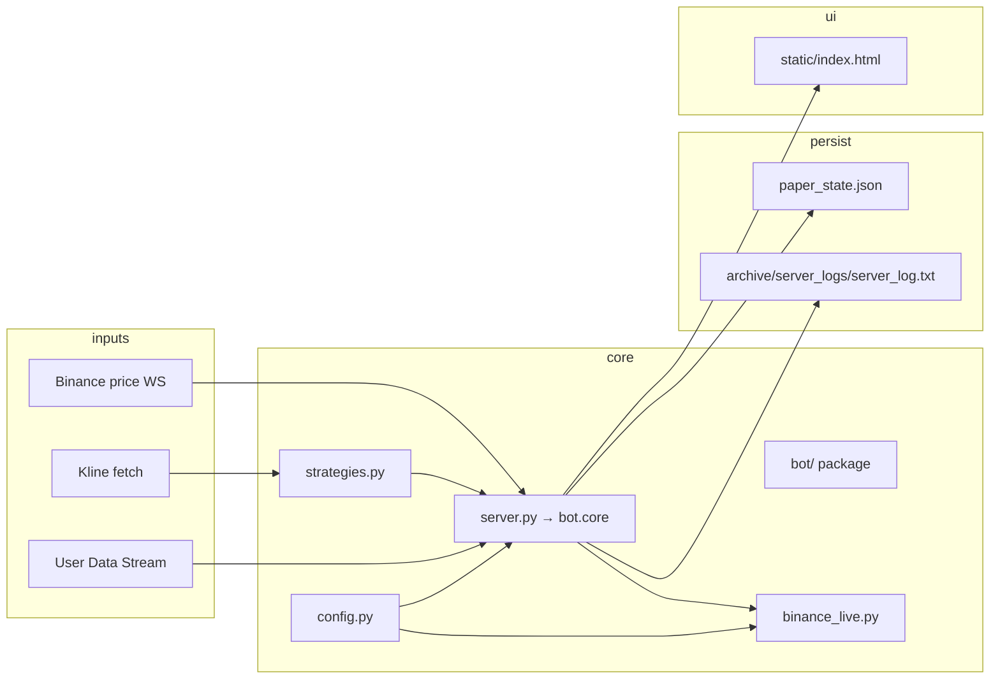

# Antigravity — Project Context

เอกสารสรุปบริบทโปรเจกตสำหรับ developer และ AI agent  
อัปเดตล่าสุด: **2026-06-19**

> รายละเอียด handoff, Change Log และกฎการแก้โค้ด → [.agents/AGENTS.md](.agents/AGENTS.md)  
> Skill สำหรับ agent → [.cursor/skills/antigravity-bot/SKILL.md](.cursor/skills/antigravity-bot/SKILL.md)

---

## เมื่อไหร่ควรอัปเดต context.md

| เอกสาร | บังคับอัปเดตเมื่อ |
|--------|-------------------|
| **`.agents/AGENTS.md`** | ทุกครั้งที่แก้โค้ด / config / dashboard / trading behavior (พร้อม Change Log) |
| **`context.md` (ไฟล์นี้)** | เฉพาะเมื่อ **ภาพรวมโปรเจกต** เปลี่ยน — ไม่ต้อง sync ทุก bug fix |

### อัปเดต `context.md` เมื่อ

- เพิ่ม/ลบ **Tab** หรือเปลี่ยน timeframe / tab map
- เปลี่ยน **architecture** — loop ใหม่, flow ใหม่, ไฟล์ core ย้ายที่
- เปลี่ยน **ค่า default สำคัญ** ใน `config.py` — `STARTUP_ENABLED_TABS`, notional, max positions, scan limit
- เพิ่ม/เปลี่ยน **env variable** ที่กระทบ runtime (เช่น `LOCAL_SLTP`, `ORDER_ENV` behavior)
- เปลี่ยน **`paper_state.json` schema** หรือ invariants สำคัญ (hedge rules, state keys)
- เพิ่ม **API endpoint** หรือ script ที่ agent/dev ใช้บ่อย
- ต้องการ **refresh สรุป changelog** ในตาราง "การเปลี่ยนแปลงล่าสุด" (ไม่จำเป็นทุกครั้ง)

### ไม่ต้องอัปเดต `context.md` เมื่อ

- Bug fix / UI tweak รายละเอียด → บันทึกใน `AGENTS.md` Change Log พอ
- ปรับ strategy parameters ย่อย → `config.py` + `AGENTS.md`
- แก้ข้อความ log / styling dashboard เล็กน้อย

---

## สรุปโปรเจกต

| หัวข้อ | รายละเอียด |
|--------|------------|
| ชื่อ | **Antigravity** — Multi-strategy crypto futures bot |
| Exchange | Binance **USDT-M Futures** (hedge mode) |
| Runtime | Python 3.11 + FastAPI (`server.py` → `bot.core`, port **8765**) |
| Strategies | Community: Tab1–Tab10 in `strategies.py`; Pro: Tab11–Tab18 in `antigravity_pro/` |
| State | `paper_state.json` (runtime — อย่า commit) |
| Config | `config.py` + `.env` |
| Dashboard | `static/index.html` → `http://localhost:8765` |
| Live orders | `binance_live.py` (signed REST + algo SL/TP) |

---

## โครงสร้างไฟล์

```
antigravity/
├── server.py              # Entry point (~25 lines); aliases bot.core
├── bot/
│   ├── core.py            # Engine hub (~8.7k lines; entry/sync/API ยังอยู่)
│   ├── logging_setup.py   # Log capture / print hook
│   ├── state/
│   │   ├── schema.py
│   │   ├── persistence.py
│   │   ├── accessors.py
│   │   └── position_identity.py
│   ├── engine/
│   │   ├── signals_registry.py
│   │   ├── premium_hooks.py   # optional Pro tab registration
│   │   ├── protection.py / protection_prices.py
│   │   ├── ops.py / sync_helpers.py
│   ├── feeds/market.py      # scan universe, mark price, entry preflight
│   ├── scheduler/         # Background loop re-exports from core
│   └── api/               # FastAPI app re-export from core
├── strategies.py          # Community signal evaluators Tab1–Tab10
├── antigravity_pro/       # Pro add-on (Tab11–Tab18) — ขายแยก; ไม่รวมใน community build
├── dist/community/        # สร้างด้วย scripts/build_community.py (Tab1–10 only)
├── binance_live.py        # Binance REST: orders, positions, income
├── config.py              # Constants, env vars, tab params
├── static/index.html      # Dashboard UI
├── paper_state.json       # Runtime state (gitignored)
├── .env                   # Secrets & flags (gitignored)
├── requirements.txt
├── context.md             # เอกสารนี้
├── .agents/AGENTS.md      # Agent handoff + Change Log
├── docs/
│   ├── strategies_spec.md
│   ├── EDITIONS.md        # Community vs Pro — build & selling workflow
│   ├── README_COMMUNITY_PUBLIC.md  # GitHub public README (→ dist/community)
│   └── GUMROAD_PRO.md     # Gumroad product page copy-paste
├── scripts/               # Utilities (reset, recovery, fetch data/logs)
├── tests/                 # Unit tests
└── archive/               # Backups: paper_state/, server_logs/ (gitignored)
```

---

## Architecture



### Background loops (`lifespan` ใน `server.py`)

| Loop | หน้าที่ |
|------|---------|
| `fetch_scan_symbols` / `refresh_scan_symbols_loop` | โหลด universe สัญลักษณ์ (`SCAN_SYMBOLS`, top N by volume) |
| `binance_ws_loop` | WebSocket ราคา real-time (last + mark) |
| `price_tick_monitor_loop` | ตรวจ local SL/TP ทุก ~1s |
| `price_poll_loop` | REST fallback ราคา |
| `scheduler_loop` | ประเมินสัญญาณตาม timeframe (1h / 4h) |
| `user_data_stream_loop` | order/position updates (เมื่อ `LIVE_MODE=true`) |
| `sync_live_positions` | reconcile state กับ exchange |
| `server_time_sync_loop` | sync เวลา Binance (กัน error -1021) |
| `income_sync_loop` | ดึง realized PnL / commission / funding |
| `process_watchdog_loop` | alert เมื่อ loop ค้าง |

### Signal → Entry flow

1. `scheduler_loop` เรียก `evaluate_candle_signals(interval)` สำหรับ `1h` / `4h`
2. แต่ละ Tab เรียก `strategies.evaluate_tab*` บน OHLCV
3. ผ่าน gate: tab enabled, ไม่ซ้ำ setup, ไม่เกิน max positions, min notional
4. `execute_entry` → live: market entry + SL/TP (exchange algo หรือ local ตาม config)

---

## Strategy Tabs (18 tabs)

| Tab | TF | Function | กลยุทธ์ |
|-----|-----|----------|---------|
| Tab1 | 4h | `evaluate_tab1_ema4h` | EMA pullback 110/190 |
| Tab2 | 4h | `evaluate_tab2_ema_1h` | EMA cross + ATR |
| Tab3 | 4h | `evaluate_tab3_smc260` | SMC order block |
| Tab4 | 4h | `evaluate_tab4_ote` | Premium/discount OTE |
| Tab5 | 1h | `evaluate_tab5_rsi_divergence_1h` | RSI divergence |
| Tab6 | 4h | `evaluate_tab6_squeeze_1h` | BB/KC squeeze |
| Tab7 | 4h | `evaluate_tab7_cci_1h` | CCI |
| Tab8 | 1h | `evaluate_tab8_three_soldiers_crows` | Three soldiers/crows |
| Tab9 | 1h | `evaluate_tab9_impulse_move_continuation` | Impulse continuation |
| Tab10 | 1h | `evaluate_tab10_vol_range_expansion_spike` | Volume range expansion |
| Tab11 | 1h | `evaluate_tab11_volume_pressure_proxy` | Volume pressure |
| Tab12 | 1h | `evaluate_tab12_volume_spike_breakout` | Volume spike breakout |
| Tab13 | 4h | `evaluate_tab13_impulse_move_continuation_4h` | retag Tab9 |
| Tab14 | 4h | `evaluate_tab14_vol_range_expansion_spike_4h` | retag Tab10 |
| Tab15 | 4h | `evaluate_tab15_volume_pressure_proxy_4h` | retag Tab11 |
| Tab16 | 4h | `evaluate_tab16_volume_spike_breakout_4h` | retag Tab12 |
| Tab17 | 1h | `evaluate_tab17_momentum_vol_pressure_1h` | Tab11 signal + momentum universe |
| Tab18 | 1h | `evaluate_tab18_volume_pressure_breakout_1h` | Volume pressure breakout (0.585 long, 0.428 short, EMA40, SL 1.8875, RR 0.85) |

**Startup default (fresh state):** เปิดเฉพาะ **Tab3** และ **Tab11** (`STARTUP_ENABLED_TABS`)

พารามิเตอร์ละเอียด: `config.py` และ `docs/strategies_spec.md`

---

## ค่า Config ปัจจุบัน (defaults)

| ค่า | Default | หมายเหตุ |
|-----|---------|----------|
| `NOTIONAL_SIZE` | 100 USD | จาก `.env` (restart required) |
| `margin_size` | 20 USD | จาก `.env`; sync กับ leverage/notional |
| `leverage` | 5 | ปรับได้จาก dashboard (1–20); default จาก `.env` `LEVERAGE` |
| `MAX_POSITIONS_PER_TAB` | 30 | ปรับได้จาก dashboard |
| `SYMBOL_SCAN_LIMIT` | 100 | ปรับได้ 100–500 จาก dashboard |
| `LEVERAGE` | 5 | default จาก `.env` (reset/migrate เท่านั้น) |
| `INITIAL_BALANCE` | 7000 USD | ต่อ tab (paper) |
| `DASHBOARD_PORT` | 8765 | พอร์ต dashboard (Chrome/Edge block 6000) |
| `EQUITY_CURVE_MARGIN_BASELINE` | 7000 USD | LIVE All-tab equity curve start |
| `MAX_SL_PCT` | 8.5% | hard cap SL distance |
| `LOCAL_SLTP` | false | mainnet: SL/TP ใน state แทน algo orders |
| `CIRCUIT_BREAKER_DAILY_LOSS` | 1000 USD | จาก `.env` |

---

## Environment Variables (`.env`)

| Variable | ความหมาย |
|----------|----------|
| `LIVE_MODE` | `true` = ส่ง order จริง |
| `ORDER_ENV` | `testnet` \| `mainnet` — ส่งคำสั่ง |
| `PRICE_FEED_ENV` | `testnet` \| `mainnet` — ดึงราคา/kline (แยกจาก ORDER_ENV ได้) |
| `LOCAL_SLTP` | `true` = mainnet ไม่วาง SL/TP algo บน exchange |
| `BINANCE_API_KEY` / `SECRET` | API credentials |
| `BINANCE_API_ACCOUNT_TYPE` | `futures_regular` \| `leader_trade` |
| `LEVERAGE` | default 5 |
| `DASHBOARD_PASSCODE` | auth (ถ้าเปิด) |
| `CIRCUIT_BREAKER_DAILY_LOSS` | daily loss limit (USD) |
| `TELEGRAM_*` | error/trade alerts |

---

## Critical Invariants (ห้ามพัง)

### Hedge mode + position_side

- ทุก live order/close/cancel ต้องส่ง `positionSide` (`LONG` / `SHORT`)
- Reconcile ระดับ `(symbol, position_side)` ไม่ใช่แค่ symbol
- State position key = `{symbol}_{tab}` (เช่น `BTCUSDT_Tab11`)
- หลาย Tab อาจ share hedge leg เดียวกันได้

### Setup keys vs position keys

- **`used_setups`:** `{sym}_{TabN}_{signal_ts}` — กัน re-entry บน signal เดิม
- **`open_positions`:** `{sym}_{TabN}` — หนึ่ง position ต่อ symbol+tab

### State safety

- `save_state()` เขียน atomic (temp file + `os.replace`)
- `_state_write_guard_allows_save()` บล็อก save ที่ history/open หดผิดปกติ
- **อย่า** ย้าย `paper_state.json` โดยไม่แก้ path ทุกจุด

### Single instance

- `server.lock` + Windows mutex `Local\AntigravityMultiStrategyServer`
- เช็ก process บนพอร์ต dashboard (`DASHBOARD_PORT`, default 8765) ก่อน debug

### อื่นๆ

- WS ticker URL ต้องใช้ `/market/ws/!ticker@arr` (ดู `PRICE_FEED_WS_URL`)
- SL/TP / unrealized ใช้ **mark price** (ไม่ใช่ last)
- Binance จำกัด open algo orders ~100 — recovery ต้องไม่ spam SL/TP

---

## paper_state.json (schema ย่อ)

```json
{
  "balances": { "Tab1": 7000.0 },
  "unrealized_pnls": { "Tab1": 0.0 },
  "open_positions": {
    "BTCUSDT_Tab11": {
      "symbol": "BTCUSDT",
      "tab": "Tab11",
      "side": "long",
      "position_side": "LONG",
      "entry": 95000.0,
      "sl": 94000.0,
      "tp": 97000.0,
      "sl_order_id": 123,
      "tp_order_id": 456,
      "protection_mode": "local"
    }
  },
  "history": [],
  "used_setups": [],
  "tab_enabled": { "Tab3": true, "Tab11": true },
  "max_positions_per_tab": 30,
  "margin_size": 2,
  "leverage": 5,
  "notional_size": 10,
  "symbol_scan_limit": 100,
  "circuit_breaker": false,
  "binance_income": {},
  "sync_issues": [],
  "error_events": []
}
```

---

## วิธีรัน & Verify

```powershell
cd E:\antigravity
.\.venv\Scripts\python.exe server.py
```

```powershell
# compile check
.\.venv\Scripts\python.exe -m py_compile server.py binance_live.py strategies.py

# unit tests
.\.venv\Scripts\python.exe -m unittest discover -s tests -t . -p "test_*.py"
```

- ใช้ **`.venv`** เท่านั้น (ไม่ใช้ `venv/`)
- Dashboard: `http://localhost:8765`
- Dependencies: `requirements.txt` (ccxt, pandas, fastapi, uvicorn, websockets, …)

---

## API Endpoints (หลัก)

| Method | Path | 用途 |
|--------|------|------|
| GET | `/` | Dashboard HTML |
| WS | `/ws` | Real-time updates |
| GET | `/api/trades` | Trade history |
| GET | `/api/health` | Health snapshot |
| GET | `/api/logs` | Log buffer |
| POST | `/api/tab-enabled` | เปิด/ปิด tab |
| POST | `/api/tabs-enabled-all` | เปิด/ปิดทุก tab |
| POST | `/api/max-positions` | ปรับ max positions ต่อ tab |
| POST | `/api/notional-size` | ปรับ notional size (sync margin) |
| POST | `/api/leverage` | ปรับ leverage (sync notional) |
| POST | `/api/margin-size` | ปรับ margin size (sync notional) |
| POST | `/api/symbol-scan-limit` | ปรับจำนวน symbol scan |
| POST | `/api/close-all` | ปิดทุก position |

---

## Scripts ที่ใช้บ่อย

| Script | หน้าที่ |
|--------|---------|
| `scripts/reset_state.py` | reset state ใหม่ (balance, tabs, history) |
| `scripts/clear_open_positions.py` | ล้าง open positions โดยไม่ลบ history |
| `scripts/reset_tab.py` | reset balance tab เดียว |
| `scripts/fix_naked_positions.py` | repair position ที่ไม่มี SL/TP |
| `scripts/fetch_data.py` | ดึง OHLCV → `cache/` |
| `scripts/fetch_logs.py` | ดึง server logs |

---

## Tests

| ไฟล์ | ครอบคลุม |
|------|----------|
| `tests/test_server_hedge.py` | hedge mode, SL/TP, sync, close, PnL |
| `tests/test_volume_strategies.py` | Tab10–12 signal logic |
| `tests/test_binance_live_time.py` | server time sync (-1021) |
| `tests/test_order.py` | order helpers |
| `tests/test_ws.py` | WebSocket |

**รัน hedge tests ทุกครั้งหลังแก้ live order / sync / close logic**

---

## Dashboard Features (สรุป)

- **PnL Overview:** Account PnL (Binance) + Strategy PnL (bot) คู่กัน
- **Binance Account:** Margin Balance, Unrealized, Today Profit, Total Profit/Loss
- **Live Prices:** BTC, ETH, XAU (gold), CL (WTI crude)
- **Strategy Performance:** ON/OFF per tab, Unrealized + Total PnL per tab
- **Risk controls:** Max positions, Notional size, Symbol scan limit (100–500)
- **TP Beep:** เสียงแจ้งเตือนเมื่อปิด TP (toggle ได้)

---

## Ignored Paths (`.cursorignore`)

AI index ไม่เห็น: `.env`, `.venv/`, `paper_state.json`, `server_log.txt*`, `archive/`, backups  
→ ใช้ terminal/read tools ถ้าต้องการอ่าน

---

## งานทั่วไป — ไปที่ไหน

| งาน | ไฟล์ / เอกสาร |
|-----|---------------|
| เพิ่ม/แก้ strategy Tab | `.cursor/skills/antigravity-add-strategy/SKILL.md`, `config.py`, `strategies.py`, `docs/strategies_spec.md` |
| แก้ live order / SL-TP / sync | `binance_live.py`, `sync_live_positions()` ใน `server.py` |
| แก้ dashboard UI | `static/index.html` |
| Hedge ownership bugs | `tests/test_server_hedge.py` |
| Reset / recovery | `scripts/` |

---

## การเปลี่ยนแปลงล่าสุด (สรุป)

| วันที่ | หัวข้อ |
|--------|--------|
| 2026-05-28 | Startup default ON เฉพาะ Tab3 + Tab11 |
| 2026-05-28 | Dashboard Total Profit/Loss ตรง Binance income |
| 2026-05-28 | Strategy Performance Unrealized ตรง Binance (live) |
| 2026-05-26 | Fix Close Tab — ไม่ปิด sibling strategy บน hedge leg เดียวกัน |
| 2026-05-25 | Today Profit card จาก Binance income (UTC day) |
| 2026-05-25 | ย้าย backup/log → `archive/` |
| 2026-05-23 | Close All + rate-limit — ลบ stale state, กัน phantom entry |
| 2026-05-18 | `LOCAL_SLTP` — mainnet ไม่วาง SL/TP algo บน exchange |
| 2026-05-18 | ราคา mark แทน last (WS + poll + dashboard) |

Change Log เต็ม → [.agents/AGENTS.md](.agents/AGENTS.md)

---

## หมายเหตุสำหรับ AI Agent

1. อ่าน `.agents/AGENTS.md` ก่อนแก้โค้ด trading/runtime
2. หลังแก้ code/config/dashboard → เพิ่ม Change Log entry ใน `AGENTS.md` (**บังคับ**)
3. ถ้างานกระทบภาพรวม (ดู section "เมื่อไหร่ควรอัปเดต context.md" ด้านบน) → อัปเดต `context.md` ในชุดงานเดียวกัน
4. Cursor rule **`.cursor/rules/antigravity-docs.mdc`** (`alwaysApply: true`) — agent เห็น checklist ทุก session
5. อย่า commit `.env`, `paper_state.json`, logs, backups
6. ใช้ `.venv` สำหรับรัน Python
7. Hedge mode: ทดสอบด้วย `test_server_hedge.py` หลังแก้ order/sync
